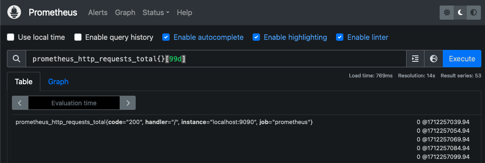

# Getting Started Guide for Amazon Timestream Prometheus Connector

## Table of Contents
  * [Overview](#overview)
  * [Terminology](#terminology)
  * [Configure Amazon Timestream](#configure-amazon-timestream)
    + [Configure AWS Credentials](#configure-aws-credentials)
    + [Create a database and table on Amazon Timestream](#create-a-database-and-table-on-amazon-timestream)
  * [Configure Prometheus Connector](#configure-prometheus-connector)
    + [Linux Binary](#linux-binary)
    + [Docker Image](#docker-image)
      - [Download and Install Docker](#download-and-install-docker)
      - [Download the Prometheus Connector Docker Image](#download-the-prometheus-connector-docker-image)
      - [Load the Prometheus Connector Docker Image](#load-the-prometheus-connector-docker-image)
      - [Run the Prometheus Connector Docker Image](#run-the-prometheus-connector-docker-image)
  * [Configure Prometheus](#configure-prometheus)
  * [Verification](#verification)
  * [Troubleshooting](#troubleshooting)
  * [Limitation](#limitation)
  * [License](#license)

## Overview

This tutorial consists of the following getting started steps:

1. Set up a new Amazon Web Services (AWS) account.
2. Set up the time series database service Amazon Timestream.
3. Integrate Amazon Timestream as the monitoring system Prometheus' [remote storage](https://prometheus.io/docs/prometheus/latest/storage/#remote-storage-integrations).

## Terminology

This getting started guide defines the following terms:

- **AWS**: the cloud platform [Amazon Web Services (AWS)](https://aws.amazon.com/what-is-aws/).
- **AWS CLI**: the [AWS Command Line Interface (AWS CLI)](https://docs.aws.amazon.com/cli/latest/userguide/cli-chap-welcome.html).
- **Amazon Timestream**: the time series database service [Amazon Timestream](https://aws.amazon.com/timestream/).
- **Prometheus Connector**: the Prometheus remote storage connector for [Amazon Timestream](https://aws.amazon.com/timestream/).
- **Prometheus**: the open source monitoring system [Prometheus]( https://prometheus.io/).

## Configure Amazon Timestream

### Configure AWS Credentials

1. [Create and activate a new AWS account](https://aws.amazon.com/premiumsupport/knowledge-center/create-and-activate-aws-account/).
2. This guide uses the AWS CLI to access Amazon Timestream. To configure the AWS CLI for Amazon Timestream see [Accessing Amazon Timestream Using the AWS CLI](https://docs.aws.amazon.com/timestream/latest/developerguide/Tools.CLI.html).
3. Ensure the account or user running this has sufficient access to Amazon Timestream. See [Identity and Access Management for Amazon Timestream](https://docs.aws.amazon.com/timestream/latest/developerguide/security-iam.html) for all the policies and permissions available for Amazon Timestream.

### Create a database and table on Amazon Timestream

1. Create a database called `exampleDatabase` by running the following command in a command-line interface:

   ```shell
   aws timestream-write create-database --database-name exampleDatabase
   ```

2. Create a table called `exampleTable` within `exampleDatabase` with the following command:

   ```shell
   aws timestream-write create-table --database-name exampleDatabase --table-name exampleTable
   ```

3. Run the following `describe-table` command to ensure that the database and table creation succeeded:

   ```shell
   aws timestream-write describe-table --database-name exampleDatabase --table-name exampleTable
   ```

## Configure Prometheus Connector

Users can run the Prometheus Connector with precompiled Linux binary or Docker image.

### Linux Binary

1. Download the tarball containing the precompiled binary for Linux named `timestream-prometheus-connector-linux-amd64-1.0.2.tar.gz`.
2. Extract the tarball and navigate to the extracted folder by running the following commands in a terminal:
    ```shell script
    tar xvfz timestream-prometheus-connector-*.tar.gz
    cd linux
    ```
3. Run the binary with required arguments `database-label` and `table-label`.
    ```shell script
    ./timestream-prometheus-connector-linux-amd64-1.0.2 --database-label=PrometheusDatabaseLabel  --table-label=PrometheusTableLabel
    ```

### Docker Image

#### Download and Install Docker
Follow the instructions for the corresponding platform to download and install Docker.
 
* **MacOS** &mdash; https://docs.docker.com/docker-for-mac/install/
* **Windows** &mdash; https://docs.docker.com/docker-for-windows/install/
* **Linux** &mdash; https://docs.docker.com/engine/install/
  
#### Download the Prometheus Connector Docker Image
1. Download the Prometheus Connector Docker image named `timestream-prometheus-connector-docker-image-1.0.2.tar.gz`.
2. Store the Docker image in a directory.

#### Load the Prometheus Connector Docker Image
1. Navigate to the directory containing the Docker image on a command-line interface.
2. Load the Docker image with the following command:
    ```shell script
    docker load < timestream-prometheus-connector-docker-image-1.0.2.tar.gz
    ```
#### Run the Prometheus Connector Docker Image
* **Linux and MacOS** &mdash; Run the Docker image with the following command:
    ```shell script
    docker run \
    -v $HOME/.aws/credentials:/root/.aws/credentials:ro \
    -p 9201:9201 \
    timestream-prometheus-connector-docker \
    --database-label=PrometheusDatabaseLabel \ 
    --table-label=PrometheusTableLabel 
    ```
* **Windows** &mdash; Run the Docker image with the following command:
    ```shell script
    docker run ^
    -v "%USERPROFILE%/.aws/credentials:/root/.aws/credentials:ro" ^
    -p 9201:9201 ^
    timestream-prometheus-connector-docker ^
    --database-label=PrometheusDatabaseLabel ^
    --table-label=PrometheusTableLabel 
    ```
  
The command does the following:
1. Mount the AWS credentials located at `$HOME/.aws/credentials` or `%USERPROFILE%/.aws/credentials` on the Docker host to a volume in the Docker container `/root/.aws/credentials:ro`.
2. Publish port 9201 in the Docker container to port 9201 in the Docker host. This allows services outside of the Docker container to access the connector running on port 9201 in the Docker container.
3. Run the docker image named `timestream-prometheus-connector-docker` with required configuration options `database-label` and `table-label`.

## Configure Prometheus

1. Download the appropriate tarball containing precompiled binary for Prometheus from their official [website](https://prometheus.io/download/).

2. Extract the tarball with the following command:

   ```bash
   tar xvfz prometheus-*.tar.gz
   cd prometheus-*
   ```

   Keep the command-line interface open.

3. The extracted tarball contains a precompiled binary called `prometheus` or `prometheus.exe` and a configuration file `prometheus.yml`.

4. Add the following configuration to the end of `prometheus.yml`:

   ```
   remote_write:
     - url: "http://localhost:9201/write"
   
       queue_config:
         max_samples_per_send: 100
   
       write_relabel_configs:
       # Configure ingestion destination.
       - source_labels: ["__name__"]
         regex: .*
         replacement: exampleDatabase
         target_label: PrometheusDatabaseLabel
       - source_labels: ["__name__"]
         regex: .*
         replacement: exampleTable
         target_label: PrometheusTableLabel
   
   remote_read:
     - url: "http://localhost:9201/read"
   ```

   This configuration serves the following functions:

   1. Configures Prometheus' remote storage destinations by setting the `url` options to the remote read and remote write endpoints, e.g. `"http://localhost:9201/write"`.
   2. Configures the Amazon Timestream ingestion destination for Prometheus time series by attaching a label indicating the destination database and another label indicating the destination table for all time series. **These labels are required to be present on all Prometheus time series sent to the Prometheus Connector.** If one of the labels cannot be found on any of the time series, the Prometheus Connector will log the error and halt the program. 

   For an example of a complete Prometheus YAML file, see [getting_started.yml](./documentation/example/getting_started.yml).

5. Back to the command-line interface, run the precompiled binary for Prometheus with the following command:

   1. **Windows** &mdash; `prometheus --config.file=prometheus.yml`
   2. **Linux and MacOS** &mdash; `./prometheus --config.file=prometheus.yml`

## Verification

1. To verify Prometheus is running, open `http://localhost:9090/` in a browser, this opens Prometheus' [expression browser](https://prometheus.io/docs/visualization/browser/#expression-browser).

2. To verify the Prometheus Connector is ready to receive requests, ensure the following log message is printed. See the [Troubleshooting](#troubleshooting) section for other error messages.

   ```log
   level=info ts=2020-11-21T01:06:49.188Z caller=utils.go:33 message="Successfully created Timestream clients to handle read and write requests from Prometheus."
   ```

3. To verify the Prometheus Connector is ingesting data, use the AWS CLI to execute the following query:

    ```shell
    aws timestream-query query --query-string "SELECT count() FROM exampleDatabase.exampleTable"
    ```
    
    The output should look similar to the following:
    
    ```json
    {
        "Rows": [
            {
                "Data": [
                    {
                        "ScalarValue": "340"
                    }
                ]
            }
        ],
        "ColumnInfo": [
            {
                "Name": "_col0",
                "Type": {
                    "ScalarType": "BIGINT"
                }
            }
        ],
        "QueryId": "AEBQEAMYNBGX7RA"
    }
    ```
    
    This sample output indicates that 340 rows has been ingested.
   
4. To verify the Prometheus Connector can query date from Amazon Timestream, query with Prometheus Query Language (PromQL) in the `http://localhost:9090/` in a browser, which opens Prometheus' [expression browser](https://prometheus.io/docs/visualization/browser/#expression-browser). 
   The PromQL must contain `database-label` and `table-label` as part of the label matchers to indicate which database and table contain the data. Here is a simple example:
   
   ```
   prometheus_http_requests_total{PrometheusDatabaseLabel="exampleDatabase", PrometheusTableLabel="exampleTable"}
   ```
   `prometheus_http_requests_total` is a metric name. `PrometheusDatabaseLabel` and `PrometheusTableLabel` are the corresponding `database-label` and `table-label` in the Prometheus configuration.
   This PromQL will return all the time series from the past hour with the metric name `prometheus_http_requests_total` in `exampleTable` of `exampleDatabase`.
   Here is a query result example:
   
   
   PromQL also supports regex, here is an example:
   ```
   prometheus_http_requests_total{handler!="/api/v1/query", job=~"p*", code!~"2..", PrometheusDatabaseLabel="exampleDatabase", PrometheusTableLabel="exampleTable"}
   ```
   This example is querying for all rows from `exampleTable` of `exampleDatabase` where:
  
   - column `metric name` equals to `prometheus_http_requests_total`;
   - column `handler` does not equal to `/api/v1/query`;
   - column `job` matches the regex pattern `p*`;
   - column `code` does not match the regex pattern `2..`.
  
   For more examples, see [Prometheus Query Examples](https://prometheus.io/docs/prometheus/latest/querying/examples/).
   There are other ways to execute PromQLs, such as through Prometheus' [HTTP API](https://prometheus.io/docs/prometheus/latest/querying/api/), or through [Grafana](https://grafana.com/).

## Troubleshooting

1. No Credential Providers Error
    
    Error occurred when running the Linux binary with the following message:
    ```log
    level=error ts=2020-11-21T00:22:06.203Z caller=utils.go:23 message="Unable to create a query client." error="NoCredentialProviders: no valid providers in chain. Deprecated.\n\tFor verbose messaging see aws.Config.CredentialsChainVerboseErrors"
    ```
    This error may occur when no AWS credentials can be found. Follow the steps in [Configure AWS Credentials](#configure-aws-credentials) to set up the credentials.

2. Expired Token Exception

    Error occurred when running the Linux binary with the following message:
    ```log
    level=error ts=2020-11-21T00:44:40.199Z caller=utils.go:23 message="Unable to create a query client." error="ExpiredTokenException: The security token included in the request is expired\n\tstatus code: 403, request id: 1adc7278-cc69-46f2-a13c-65bf3d8f50f1"
    ```
    This error message may occur if [temporary security credentials](https://docs.aws.amazon.com/IAM/latest/UserGuide/id_credentials_temp.html) are used to run the Prometheus Connector. To update the temporary security credentials see [Requesting temporary security credentials](https://docs.aws.amazon.com/IAM/latest/UserGuide/id_credentials_temp_request.html).
   
3. Access Denied Exception
    
    Error occurred when running the Linux binary with the following message:
    ```log
    level=error ts=2020-11-23T19:58:49.998Z caller=utils.go:23 message="Unable to create a query client." error="AccessDeniedException: User: arn:aws:iam::0000000000:user/username is not authorized to perform: timestream:DescribeEndpoints with an explicit deny"
    ```
    1. Ensure the account running the Prometheus Connector has sufficient permissions to access Timestream. See all the IAM Policies for Timestream on [How Amazon Timestream Works with IAM](https://docs.aws.amazon.com/timestream/latest/developerguide/security_iam_service-with-iam.html).
    2. Ensure you are using a temporary security credentials to access Amazon Timestream. See how to use temporary security credentials to access AWS resources with AWS CLI on [Using temporary credentials](https://docs.aws.amazon.com/IAM/latest/UserGuide/id_credentials_temp_use-resources.html#using-temp-creds-sdk-cli). 
    
4. Conflicting Resources Error
    
    Error occurred when running the Docker image with the following message:
    ```log
    docker: Error response from daemon: driver failed programming external connectivity on endpoint silly_proskuriakova 
    (1823ad1d6139911298536cdab0b08b38981d83cb124ad971e2b944a51c272438): Bind for 0.0.0.0:9201 failed: port is already allocated.
    ```
    The port number is not available because it is in use. 
    
    If the resource occupying this port cannot be freed:
    1. Run the connector with a custom listen-address with the ` --web.listen-address` option and with the updated `-p` flag to publish the custom port. An example running the Docker container on port 3080 is as follows:
        ```shell script
        docker run \
        -v $HOME/.aws/credentials:/root/.aws/credentials:ro \
        -p 3080:3080 \
        timestream-prometheus-connector-docker \
        --database-label=PrometheusDatabaseLabel \ 
        --table-label=PrometheusTableLabel \
        --web.listen-address=:3080
        ``` 
    If the port is used by a Docker container that could be removed:
    1. Use [docker rm](https://docs.docker.com/engine/reference/commandline/rm/) to remove the container.
    
5. Invalid Mount Path Error

   Error occurred when running the Docker image with the following message:
   ```log
   docker: Error response from daemon: invalid volume specification: '/host_mnt/c/Users/<user_name>/.aws/credentials: .aws/credentials:ro': 
   invalid mount config for type "bind": invalid mount path: ' .aws/credentials' mount path must be absolute.
   ```
   Ensure there are no extra spaces when setting the `-v` flag. See more details regarding the `-v` flag in Docker's [documentation](https://docs.docker.com/storage/volumes/#choose-the--v-or---mount-flag).
   
   Invalid example: 
   ```
   -v "%USERPROFILE%/.aws/credentials: /root/.aws/credentials:ro
   ```
   Valid example: 
   ```
   -v "%USERPROFILE%/.aws/credentials:/root/.aws/credentials:ro
   ```
   
## Limitation

There is currently no authentication or encryption between Prometheus and the Prometheus Connector. Once the Prometheus Connector has been initialized, anyone can send a request to the endpoint. Ensure the Prometheus and the Prometheus Connector are running in the same trust zone.

## License

This getting started guide is licensed under the Apache 2.0 License.
