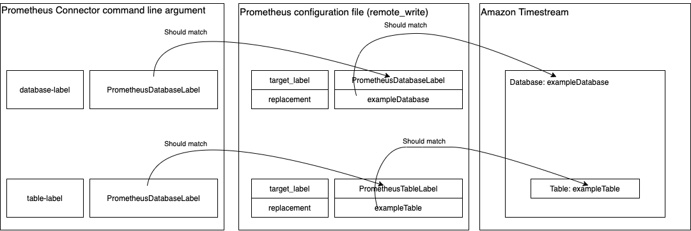
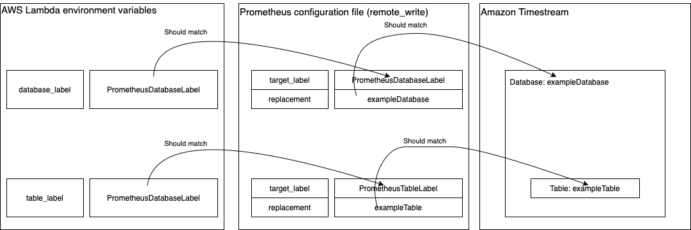

# Amazon Timestream Prometheus Connector
This Prometheus Connector receives and sends time series data between Prometheus and Amazon Timestream through Prometheus' [remote write and remote read](https://prometheus.io/docs/prometheus/latest/storage/#remote-storage-integrations) protocols.

# Table of contents
- [Prerequisites](#prerequisites)
- [User Documentation](#user-documentation)
  - [Getting Started](#getting-started)
    - [Prometheus Configuration](#prometheus-configuration)
    - [Run with Precompiled Binaries](#run-with-precompiled-binaries)
    - [Run with Docker Image](#run-with-docker-image)
    - [Run with AWS Lambda](#run-with-aws-lambda)
    - [Start Prometheus](#start-prometheus)
  - [Configuration Options](#configuration-options)
    - [Standard Configuration Options](#standard-configuration-options)
    - [Retry Configuration Options](#retry-configuration-options)
    - [Logger Configuration Options](#logger-configuration-options)
    - [Multi-destination Configuration](#multi-destination-configuration)
  - [Relabel Long Labels](#relabel-long-labels)
  - [Authentication](#authentication)
- [Developer Documentation](#developer-documentation)
  - [Building the Prometheus Connector from Source](#building-the-prometheus-connector-from-source)
  - [Building the Docker Image](#building-the-docker-image)
- [Troubleshooting](#troubleshooting)
  - [Prometheus Connector Specific Errors](#prometheus-connector-specific-errors)
  - [Write API Errors](#write-api-errors)
  - [Query API Errors](#query-api-errors)
- [Limitations](#limitations)
    - [Maximum Prometheus Samples Per Remote Write Request](#maximum-prometheus-samples-per-remote-write-request)
- [Caveats](#caveats)
    - [Unsupported RE2 Syntax](#unsupported-re2-syntax)
    - [Inaccurate Prometheus Metrics](#inaccurate-prometheus-metrics)
    - [Error Returned On Successful Ingestion](#error-returned-on-successful-ingestion)
    - [Data Loss During Data Ingestion](#data-loss-during-data-ingestion)
- [License](#license)

# Prerequisites
1. **Sign up for AWS** &mdash; Before beginning, have an AWS account. For more information about creating an AWS account and retrieving your AWS credentials, see [Signing Up for AWS](https://docs.aws.amazon.com/timestream/latest/developerguide/accessing.html#SettingUp.Q.SignUpForAWS).
2. **Amazon Timestream**  &mdash; Have databases and tables created on Amazon Timestream. To create databases and tables on Amazon Timestream, see [Accessing Timestream](https://docs.aws.amazon.com/timestream/latest/developerguide/accessing.html).
3. **Minimum requirements** &mdash; The Amazon Timestream Prometheus Connector for Go requires **Go 1.14** or later.
4. **Prometheus** &mdash; Download Prometheus from their [Download](https://prometheus.io/download/) page. To learn more about Prometheus, see their [introduction documentation](https://prometheus.io/docs/introduction/overview/).
5. **Docker** &mdash; Docker is only required when building or running the Docker image. To download Docker, see [Get Started with Docker](https://www.docker.com/get-started).

# User Documentation

## Getting Started

The Prometheus Connector will be available in the following formats:
- precompiled binaries;
- a Docker image;
- a ZIP file of the precompiled binary for Linux that can be integrated with AWS Lambda.

### Prometheus Configuration

To configure Prometheus to read and write to remote storage, configure the `remote_read` and `remote_write` sections in `prometheus.yml`. To learn more, see the [remote read](https://prometheus.io/docs/prometheus/latest/configuration/configuration/#remote_read) and [remote write](https://prometheus.io/docs/prometheus/latest/configuration/configuration/#remote_write) sections on Prometheus' configuration page.
> **NOTE**: It is recommended to use the default number of samples per write request through `max_samples_per_send`. For more details see [Maximum Prometheus Samples Per Remote Write Request](#maximum-prometheus-samples-per-remote-write-request).

1. Configure Prometheus' remote read and remote write destination by setting the `url` options to the Prometheus Connector's listening URLs, e.g. `"http://localhost:9201/write"`.
2. Configure the Amazon Timestream ingestion destination for Prometheus time series by attaching a label indicating the destination database and another label indicating the destination table for all time series. **These labels are required to be present on all Prometheus time series sent to the Prometheus Connector.** If one of the labels cannot be found on any of the time series, the Prometheus Connector will log the error and halt the program. 

The required labels can be added through the `write_relabel_configs` in `prometheus.yml`.
In the following example, each Prometheus time series will be appended with two labels, `PrometheusTableLabel` and `PrometheusDatabaseLabel` with label values `exampleTable` and `exampleDatabase` respectively.

```yaml
   write_relabel_configs:
    - source_labels: ["__name__"]
      regex: .*
      replacement: exampleTable
      target_label: PrometheusTableLabel
    - source_labels: ["__name__"]
      regex: .*
      replacement: exampleDatabase
      target_label: PrometheusDatabaseLabel
```

In this example, all the Prometheus time series will be ingested into exampleTable within exampleDatabase.

> **NOTE**: These labels will not be ingested into Amazon Timestream, the purpose of these additional labels is to provide ingestion destination information to the Prometheus Connector.

For more details regarding multi-destination configuration, see the [Multi-destination Configuration](#multi-destination-configuration) section.

Here is an example of `remote_write` and `remote_read` configuration:

```yaml
  remote_write:
    - url: "http://localhost:9201/write"

      write_relabel_configs:
        - source_labels: ["__name__"]
          regex: .*
          replacement: tableName
          target_label: PrometheusTableLabel
        - source_labels: ["__name__"]
          regex: .*
          replacement: databaseName
          target_label: PrometheusDatabaseLabel

  remote_read:
  - url: "http://localhost:9201/read"
```

See a full sample in [simple-example.yml](./documentation/example/simple-example.yml).

### Run with Precompiled Binaries

Run the precompiled binaries with required arguments `database-label` and `table-label`.

| Platform | Command                                                      |
| -------- | ------------------------------------------------------------ |
| Linux    | `./timestream-prometheus-connector-linux-amd64-1.0.2 --database-label=PrometheusDatabaseLabel  --table-label=PrometheusTableLabel` |
| MacOS    | `./timestream-prometheus-connector-darwin-amd64-1.0.2 --database-label=PrometheusDatabaseLabel  --table-label=PrometheusTableLabel` |
| Windows  | `timestream-prometheus-connector-windows-amd64-1.0.2 --database-label=PrometheusDatabaseLabel  --table-label=PrometheusTableLabel` |

The arguments `database-label` and `table-label` should match the label name `prometheus.yml` set in the previous section [Prometheus Configuration](#prometheus-configuration), which is `PrometheusDatabaseLabel` and `PrometheusTableLabel` in this example.

For more examples on configuring the Prometheus Connector see [Configuration Options](#configuration-options).

#### Running Precompiled Binary for MacOS

The following error message may show up when running the precompiled binary on MacOS:

`"timestream-prometheus-connector-darwin-amd64" cannot be opened because the developer cannot be verified.`

Follow these steps to resolve:

1. Choose `Apple menu` > `System Preferences`.
2. Select `Security & Privacy`.
3. Under the `General` tab, select `Open Anyway`.

### Run with Docker Image
Load the Docker image by the following command:
```shell script
docker load < timestream-prometheus-connector-docker-image-1.0.2.tar.gz
```

To run the Docker image, credentials need to be passed to the Docker container, one option is to mount the AWS credentials to a volume in the Docker container with the `-v` flag such as the following:

- **Linux and MacOS**

  ```shell
  docker run \
  -v $HOME/.aws/credentials:/root/.aws/credentials:ro \
  -p 9201:9201 \
  timestream-prometheus-connector-docker \
  --database-label=PrometheusDatabaseLabel \
  --table-label=PrometheusTableLabel
  ```

- **Windows**

  ```shell
  docker run ^
  -v "%USERPROFILE%/.aws/credentials:/root/.aws/credentials:ro" ^
  -p 9201:9201 ^
  timestream-prometheus-connector-docker ^
  --database-label=PrometheusDatabaseLabel ^
  --table-label=PrometheusTableLabel
  ```

To configure the `web.listen-address` option when running the Prometheus Connector through a Docker image, use the `-p` flag to expose the custom endpoint. The following example listens on the custom endpoint `localhost:3080`:

- **Linux and MacOS**

  ```shell
  docker run \
  -v $HOME/.aws/credentials:/root/.aws/credentials:ro \
  -p 3080:3080 \
  timestream-prometheus-connector-docker \
  --database-label=PrometheusDatabaseLabel \
  --table-label=PrometheusTableLabel \
  --web.listen-address=:3080
  ```

- **Windows**

  ```shell
  docker run ^
  -v "%USERPROFILE%/.aws/credentials:/root/.aws/credentials:ro" ^
  -p 3080:3080 ^
  timestream-prometheus-connector-docker ^
  --database-label=PrometheusDatabaseLabel ^
  --table-label=PrometheusTableLabel ^
  --web.listen-address=:3080
  ```

For more information regarding the `-p` flag see the [official Docker documentation](https://docs.docker.com/engine/reference/commandline/run/#publish-or-expose-port--p---expose).

### Run with AWS Lambda
Running the Prometheus Connector on AWS Lambda allows for a serverless workflow. This section details the steps to configuring the IAM permissions to integrate the Prometheus Connector with Amazon API Gateway and AWS Lambda.

#### IAM Role and Policy Configuration

1. Open the [AWS management console](https://console.aws.amazon.com/iam/) for IAM.

2. Select `Create role`.

3. Select Lambda as the use case.

4. Click `next: Permissions`.

5. Click `Create Policy`.

6. Switch to the `JSON` tab.

7. Paste the following policy to provide basic permissions for the Lambda function to output logs to CloudWatch:

   ```json
    {
        "Version": "2012-10-17",
        "Statement": [
            {
                "Effect": "Allow",
                "Action": [
                    "logs:CreateLogGroup",
                    "logs:CreateLogStream",
                    "logs:PutLogEvents"
                ],
                "Resource": "arn:aws:logs:${AWS::Region}:${AWS::AccountId}:log-group:/aws/lambda/${LambdaFunctionName}:*"
            }
        ]
    }
   ```

8. Update the values for `${AWS::Region}`, `${AWS::AccountId}`, `${LambdaFunctionName}` in the following policy. An example of the updated value for `Resource` would be: 
    `"Resource": "arn:aws:logs:us-east-1:12345678:log-group:/aws/lambda/timestream-prometheus-connector:*"`. 

9. Click `Review Policy`.

10. Enter a policy name.

11. Follow steps 5 to 8 to create the following policy providing Amazon Timestream access to the AWS Lambda function:

     ```json
     {
         "Version": "2012-10-17",
         "Statement": [
             {
                 "Effect": "Allow",
                 "Action": [
                     "timestream:WriteRecords",
                     "timestream:Select"
                 ],
                 "Resource": "arn:aws:timestream:${AWS::Region}:${AWS::AccountId}:database/*"
             },
             {
                 "Effect": "Allow",
                 "Action": [
                     "timestream:DescribeEndpoints"
                 ],
                 "Resource": "*"
             }
         ]
     }
     ```

12. Back on the `Grant permissions` page, select the checkbox for the newly created policies.

13. Click `Next:Review`.

14. Enter a name for the role, this example will use `LambdaTimestreamFullAccessRole`.

15. After creating the role successfully, click `Roles` under `Access management` and choose the role created to see the details.

16. Take note of the `Role ARN`, this is required when creating a policy to allow the current user access to the role.

17. On the Summary page, select the `Trust relationships` tab, select `Edit Trust Relationship`.

18. Paste the following to `Policy Document` to allow API gateway to access the policy.

     ```json
     {
       "Version": "2012-10-17",
       "Statement": [
         {
           "Effect": "Allow",
           "Principal": {
             "Service": [
               "apigateway.amazonaws.com",
               "lambda.amazonaws.com"
             ]
           },
           "Action": "sts:AssumeRole"
         }
       ]
     }
     ```

19. Click `Update Trust Policy`.

To provide access to this newly created role, add a permission to the current user with the following steps:
1. Open the [AWS management console](https://console.aws.amazon.com/iam/) for IAM.
2. Under `Access mangement`, click `Users`.
3. Select the user that needs access to this role.
4. Click `Add permissions`.
5. Select `Attach existing policies directly`.
6. Click `Create policy`.
7. Switch to the `JSON` tab, and paste the following to provide the user with the permission to `PassRole` on the newly created role, where `role_arn` can be on the `Summary` page of the newly created role:

   ```json
   {
       "Version": "2012-10-17",
       "Statement": [
           {
               "Sid": "PolicyStatementToAllowUserToPassOneSpecificRole",
               "Effect": "Allow",
               "Action": [
                   "iam:PassRole"
               ],
               "Resource": "role_arn"
           }
       ]
   }
   ```

8. Click `Review Policy`.
9. Enter a policy name.
10. Click `Create policy`.
11. Attach the policy to the user.

#### Create the AWS Lambda Function

1. Open the [AWS management console](https://console.aws.amazon.com/lambda/) for AWS Lambda.
2. Click `Create function`.
3. Enter a function name, this example will use `PrometheusConnector` as the function name.
4. Choose `Go 1.x` from the Runtime dropdown.
5. Expand `Change default execution role`.
6. Select `Use an existing role`.
7. Choose the newly created role from the dropdown, for this example it will be `LambdaTimestreamFullAccessRole`.
8. Click `Create function`.

#### Configure the AWS Lambda Function

1. Open the [AWS management console](https://console.aws.amazon.com/lambda/) for AWS Lambda.
2. Select the newly created function, in this example it will be `PrometheusConnector`.
3. Under the `Function code` section, click `Actions`.
4. Select `upload a .zip file`.
5. Upload the ZIP file containing the precompiled Linux binary.
6. Click `save`.
7. Under the `Environment variables` section, click `edit`.
8. Enter the key and corresponding value of environment variables, `database_label` and `table_label` are required. Here is an example:

Go to [Configuration Options](#Configuration-options) to see more information.
9. Scroll down to basic settings.
10. Click `Edit`.
11. In the `Handler` section, enter the name of the Amazon Timestream Prometheus Connector ZIP file, which will be `timetream-prometheus-connector-1.0.2`.
12. Click `Save`.

#### Create the API on Amazon API Gateway

1. Open the [AWS management console](https://console.aws.amazon.com/apigateway/) for API Gateway.
2. Click `Create API`.
3. In `Choose an API Type`, click `build` under the `HTTP API` option.
4. Click `Add integration` and choose `Lambda`.
5. Choose the appropriate `AWS Region`.
6. Type in the name of the Lambda function created in the previous step [Create the AWS Lambda Function](#create-the-aws-lambda-function) or paste in the function's ARN. For this example, the value will be `PrometheusConnector`.
7. Click `Add integration`.
8. Type in an `API name`, this example will use `PrometheusConnectorAPI` as the API name.
9. Click `Review and Create`.
10. Click `Edit` on the `Routes` section.
11. There will be a pre-defined route `ANY /PrometheusConnector -> PrometheusConnector(Lambda)`, remove this route.
12. Click `Add route` to add a new route for **remote write**.
   1. Choose `POST` for the `Method`.
   2. Enter `/write`for the Resource Path.
   3. Select the appropriate Lambda function as the integration target, in this example it would be `PrometheusConnector`.
13. Click `Add route` to add a new route for **remote read**.
   1. Choose `POST` for the `Method`.
   2. Enter `/read` for the Resource Path.
   3. Select the appropriate Lambda function as the integration target, in this example it would be `PrometheusConnector`.
14. Click `Next` to `Step 3: Define stages`.
15. Click `Next` again.
16. Click `Create` will redirect the page to `API Details`.
17. Take note of the invoke URL, this URL is required to set up Prometheus' remote read and write URL.

#### Configure Prometheus for Lambda

1. Open `prometheus.yml` .
2. Add the following sections to the end of the file, where `{{invoke_url}}` can be found at the `API Details` section on API Gateway.

   ```YAML
   remote_write:
     - url: "{{invoke_url}}/write"
   
   remote_read:
     - url: "{{invoke_url}}/read"
   ```

   These sections configure Prometheus to send write requests to the remote write URL and read data from the remote read URL.

#### Configure Logging for API Gateway (Optional)

To configure logging for API Gateway to CloudWatch, a new CloudWatch log group needs to be created.

1. Open the [AWS management console](https://console.aws.amazon.com/cloudwatch/) for CloudWatch.
2. Click the `Log groups` under `Log` in the sidebar.
2. Select `Create log group`.
3. Enter a group name and click `Create`.
4. Select the newly created log group from the list of log groups to see the log group details.
5. Take note of the ARN.

Next, open the previously created Prometheus Connector API on [API Gateway]( https://console.aws.amazon.com/apigateway/main/apis) to configure logging.

1. Select `Logging` under the `Monitor` section on the left side.
2. Select a stage from the dropdown and click `Next`.
3. Click `Edit`.
4. Toggle `Access logging`.
5. Paste the ARN of the newly created log group.
6. Select the preferred log format.
7. Click `Save`.

If permissions are required, add the following policy to the IAM account with `region` and `account-id` updated to the appropriate values:

```json
{
    "Version": "2012-10-17",
    "Statement": [
        {
            "Effect": "Allow",
            "Action": [
                "logs:DescribeLogGroups",
                "logs:DescribeLogStreams",
                "logs:GetLogEvents",
                "logs:FilterLogEvents"
            ],
            "Resource": "arn:aws:logs:region:account-id:log-group:*"
        },
        {
            "Effect": "Allow",
            "Action": [
                "logs:CreateLogDelivery",
                "logs:PutResourcePolicy",
                "logs:UpdateLogDelivery",
                "logs:DeleteLogDelivery",
                "logs:CreateLogGroup",
                "logs:DescribeResourcePolicies",
                "logs:GetLogDelivery",
                "logs:ListLogDeliveries"
            ],
            "Resource": "*"
        }
    ]
}
```

For more information see [Configuring logging for an HTTP API](https://docs.aws.amazon.com/apigateway/latest/developerguide/http-api-logging.html).

#### View Logs on CloudWatch

A log group will automatically be created when creating a new AWS Lambda function.
The name of log group is usually in the following format: the log group named in format `/aws/lambda/{LambdaFunctionName}`.
To view the logs from the Prometheus Connector:

1. Open the [AWS management console](https://console.aws.amazon.com/cloudwatch/) for CloudWatch.
2. Click `Log groups` under `Logs`.
3. Select the log group for the Prometheus Connector. In this example it would be `/aws/lambda/PrometheusConnector` and here is an example in this log group:


### Start Prometheus
Start Prometheus by running the command: `./prometheus --config.file=prometheus.yml`.

## Configuration Options

>**NOTE:** All configuration options keys are *case-sensitive*

When running the Prometheus Connector on AWS Lambda, configuration options need to be set as Lambda environment variables. When configuring the Prometheus Connector on AWS Lambda, use the values in the `Lambda Option` column.

### Standard Configuration Options

The database-label name and table-label name are required for data ingestion and data retrieval. If they are not provided, the Prometheus Connector will return a 400 Bad Request to the caller.

| Standalone Option | Lambda Option | Description | Is Required | Default Value |
|--------|-------------|------------|---------|---------|
| `database-label` | `database_label` |  The Prometheus label containing the database name. | Yes | `None` |
| `table-label` | `table_label` |  The Prometheus label containing the table name. | Yes | `None` |
| `region` | `region` | The signing region for the Amazon Timestream service. | No | `us-east-1` |
| `web.listen-address` | `N/A` |  The endpoint to listen to for write requests and read requests sent from Prometheus. | No | `:9201` |
| `web.telemetry-path` | `N/A` | The path containing metrics collected by the Prometheus Connector, such as `ignoredSamples`. This allows Prometheus to scrape and monitor data from the specified telemetry-path. | No | `/metrics` |

> **NOTE**: `web.listen-address` and `web.telemetry-path` configuration options are not available when running the Prometheus Connector on AWS Lambda.

#### Configuration Examples

1. Configure the Prometheus Connector to access the Amazon Timestream service in the US West (Oregon) Region instead of the default US East (N. Virginia) Region.

   | Runtime              | Command                                                      |
   | -------------------- | ------------------------------------------------------------ |
   | Precompiled Binaries | `./timestream-prometheus-connector-linux-amd64-1.0.2 --database-label=PrometheusDatabaseLabel  --table-label=PrometheusTableLabel --region=us-west-2` |
   | AWS Lambda Function  | `aws lambda update-function-configuration --function-name PrometheusConnector --environment "Variables={database_label=PrometheusDatabaseLabel,table_label=PrometheusTableLabel,region=us-west-2}"` |

2. Configure the Prometheus Connector to listen for Prometheus requests on `http://localhost:3080`.

   | Runtime              | Command                                                      |
   | -------------------- | ------------------------------------------------------------ |
   | Precompiled Binaries | `./timestream-prometheus-connector-linux-amd64-1.0.2 --database-label=PrometheusDatabaseLabel  --table-label=PrometheusTableLabel --web.listen-address=:3080` |
   | AWS Lambda Function  | `N/A`                                                        |

3. Configure the Prometheus Connector to listen for Prometheus requests on `http://localhost:3080` and serve collected metrics to `http://localhost:3080/timestream-metrics`.

   | Runtime              | Command                                                      |
   | -------------------- | ------------------------------------------------------------ |
   | Precompiled Binaries | `./timestream-prometheus-connector-linux-amd64-1.0.2 --database-label=PrometheusDatabaseLabel  --table-label=PrometheusTableLabel --web.listen-address=:3080 --web.telemetry-path=/timestream-metrics` |
   | AWS Lambda Function  | `N/A`                                                        |

### Retry Configuration Options

The Prometheus Connector exposes the query SDK's retry configurations for users.

| Standalone OptionOption | Lambda Option | Description | Is Required | Default Value |
|--------|-------------|------------|---------|---------|
| `max-retries` | `max_retries` |  The maximum number of times the read request will be retried for failures. | No | 3 |

#### Configuration Examples

Configure the Prometheus Connector to retry up to 10 times upon recoverable errors.

| Runtime              | Command                                                      |
| -------------------- | ------------------------------------------------------------ |
| Precompiled Binaries | `./timestream-prometheus-connector-linux-amd64-1.0.2 --database-label=PrometheusDatabaseLabel  --table-label=PrometheusTableLabel --max-retries=10` |
| AWS Lambda Function  | `aws lambda update-function-configuration --function-name PrometheusConnector --environment "Variables={database_label=PrometheusDatabaseLabel,table_label=PrometheusTableLabel,max_retries=10}"` |

### Logger Configuration Options

| Standalone Option | Lambda Option | Description | Is Required | Default Value | Valid Values |
|--------|-------------|------------|---------|--------------|--------------|
| `enable-logging` | `enable_logging` | Enables or disables logging in the Prometheus Connector. | No | `true` | `1`, `t`, `T`, `TRUE`, `true`, `True`, `0`, `f`, `F`, `FALSE`, `false`, `False` |
| `fail-on-long-label` | `fail_on_long_label` | Enables or disables the option to halt the program immediately when a Prometheus Label name exceeds 256 bytes. | No | `false` | `1`, `t`, `T`, `TRUE`, `true`, `True`, `0`, `f`, `F`, `FALSE`, `false`, `False` |
| `fail-on-invalid-sample-value` | `fail_on_invalid_sample_value` |  Enables or disables the option to halt the program immediately when a Sample contains a non-finite float value. | No | `false` | `1`, `t`, `T`, `TRUE`, `true`, `True`, `0`, `f`, `F`, `FALSE`, `false`, `False` |
| `log.level` | `log_level` |  Sets the output level for logs. | No | `info` | `info`, `warn`, `debug`, `error` |
| `log.format` | `log_format` |  Sets the output format for the logs. The output for logs always goes to stderr, unless the logging has been disabled. | No | `logfmt` | `logfmt`, `json` |

>**NOTE:** The logging level is ***by default*** set to `info`. Set `log.level` to `debug` to view any Samples ignored due to long metric name or non-finite values.

`fail-on-long-label` &mdash; Prometheus recommends using meaningful and detailed metrics names, which may result in metric names exceeding the maximum length (256 bytes) supported by Amazon Timestream.
If a Prometheus time series has a metric name exceeding the maximum supported length, the Prometheus Connector will **by default** log and ignore the Prometheus time series. 
To quickly spot and resolve issues that may be caused by ignored Prometheus time series during development, set `fail-on-long-label` flag to `true`, and the Prometheus Connector will log and halt on a long metric name.

`fail-on-invalid-sample-value` &mdash; If the Prometheus WriteRequest contains time series with non-finite float values such as NaN, -Inf, or Inf, the Prometheus Connector will *by default* log and ignore any of those time series.
To quickly spot and resolve issues that may be caused by ignored Prometheus time series during development, set `fail-on-invalid-sample-value` flag to `true`, and the Prometheus Connector will log and halt on a Prometheus time series with non-finite float values. `fail-on-long-label` and `fail-on-invalid-sample-value` configurations are not recommended during production operation.

#### Configuration Examples

1. Disable logging in the Prometheus Connector.

   | Runtime              | Command                                                      |
   | -------------------- | ------------------------------------------------------------ |
   | Precompiled Binaries | `./timestream-prometheus-connector-linux-amd64-1.0.2 --database-label=PrometheusDatabaseLabel  --table-label=PrometheusTableLabel --enable-logging=false` |
   | AWS Lambda Function  | `aws lambda update-function-configuration --function-name PrometheusPrometheus Connector --environment "Variables={database_label=PrometheusDatabaseLabel,table_label=PrometheusTableLabel,enable_logging=false}"` |

2. Toggle the Prometheus Connector to halt on: <br />- label names exceeding the maximum length supported by Amazon Timestream;<br />- Prometheus time series with non-finite values.

   | Runtime              | Command                                                      |
   | -------------------- | ------------------------------------------------------------ |
   | Precompiled Binaries | `./timestream-prometheus-connector-linux-amd64-1.0.2 --database-label=PrometheusDatabaseLabel  --table-label=PrometheusTableLabel --fail-on-long-label=true --fail-on-invalid-sample=true` |
   | AWS Lambda Function  | `aws lambda update-function-configuration --function-name PrometheusConnector --environment "Variables={database_label=PrometheusDatabaseLabel,table_label=PrometheusTableLabel,fail_on_long_label=true, fail_on_invalid_sample_value=true}"` |

3. Configure the Prometheus Connector to output the logs at debug level and in JSON format.

    | Runtime              | Command                                                      |
    | -------------------- | ------------------------------------------------------------ |
    | Precompiled Binaries | `./timestream-prometheus-connector-linux-amd64-1.0.2 --database-label=PrometheusDatabaseLabel  --table-label=PrometheusTableLabel --log.level=debug --log.format=json` |
    | AWS Lambda Function  | `aws lambda update-function-configuration --function-name PrometheusConnector --environment "Variables={database_label=PrometheusDatabaseLabel,table_label=PrometheusTableLabel,log_level=debug, log_format=json}"` |

### Multi-destination Configuration

The Prometheus Connector supports ingesting the time series into different destinations. For instance, when monitoring a Kubernetes cluster with Prometheus, metrics collected from different nodes may need to be ingested into different databases and tables. This can be achieved through the Prometheus Connector's configuration options and the Prometheus labels.

An example of how the configuration options for the standalone Prometheus Connector are mapped to the Prometheus configuration and the Amazon Timestream databases and tables is as follows:



An example of how the configuration options for the Prometheus Connector on AWS Lambda are mapped to the Prometheus configuration and the Amazon Timestream databases and tables is as follows:



#### Prometheus Connector Configuration

The standard configuration options `database-label` and `table-label` are used to specify where the data should be stored.

Before ingesting the data, the Prometheus Connector will check the label names, and group the records according to their database and table label name. 

>  **NOTE**: These labels will not be ingested into Amazon Timestream, the purpose of these additional labels is to provide ingestion destination information to the Prometheus Connector.

#### Prometheus Labels Configuration

Prometheus allows users to modify the label set of a target by specifying relabel configurations in `prometheus.yml`. 
Therefore, users can create database labels and table labels in `prometheus.yml` under `write_relabel_configs`. Here is an example:

```yaml
# Remote write configuration.
remote_write:
  - url: "http://localhost:9201/write"

    write_relabel_configs:
    - source_labels: ["__name__"]
      regex: .*
      replacement: exampleTable
      target_label: PrometheusTableLabel
    - source_labels: ["__name__"]
      regex: .*
      replacement: exampleDatabase
      target_label: PrometheusDatabaseLabel

    - source_labels: ["__name__"]
      regex: go_.*
      replacement: golang
      target_label: PrometheusTableLabel
    - source_labels: ["__name__"]
      regex: go_.*
      replacement: golang
      target_label: PrometheusDatabaseLabel

    - source_labels: ["__name__"]
      regex: prometheus_.*
      replacement: prometheus
      target_label: PrometheusTableLabel
    - source_labels: ["__name__"]
      regex: prometheus_.*
      replacement: prometheus
      target_label: PrometheusDatabaseLabel
      
    - source_labels: ["__name__"]
      regex: promhttp_.*
      replacement: promhttp
      target_label: PrometheusTableLabel
    - source_labels: ["__name__"]
      regex: promhttp_.*
      replacement: prometheus
      target_label: PrometheusDatabaseLabel
```
This example does the following for all time series sent to the remote endpoint `"http://localhost:9201/write"`:

| No   | Action                                                       | Effect                                                       |
| ---- | ------------------------------------------------------------ | ------------------------------------------------------------ |
| 1    | Append two labels `timestreamDatabaseLabel` and `timestreamTableLabel` with values `exampleDatabase` and `exampleTable` respectively to all time series. | All Prometheus time series sent to the Prometheus Connector will be ingested into exampleTable within exampleDatabase in Amazon Timestream. |
| 2    | For all Prometheus time series with metric names starting with `go_*`, change the values of  `timestreamDatabaseLabel` and `timestreamTableLabel` from `exampleDatabase` and `exampleTable` to `golang` and `golang` respectively. | All Prometheus time series with metric names starting with `go_*` will be ingested into table golang within the database golang. |
| 3    | For all Prometheus time series with metric names starting with `prometheus_*`, change the values of  `timestreamDatabaseLabel` and `timestreamTableLabel` from `exampleDatabase` and `exampleTable` to `prometheus` and prometheus respectively. | All Prometheus time series with metric names starting with `prometheus_*` will be ingested into table prometheus within the database prometheus. |
| 4    | For all Prometheus time series with metric names starting with `promhttp_*`, change the values of  `timestreamDatabaseLabel` and `timestreamTableLabel` from `exampleDatabase` and `exampleTable` to `promhttp` and `prometheus` respectively. | All Prometheus time series with metric names starting with `promhttp_*` will be ingested into table promhttp within the database prometheus. |

See the full example in [multi-destination-example.yml](documentation/example/multi-destination-example.yml).


## Relabel Long Labels

If a Prometheus time series has a metric name exceeding the maximum supported length, the Prometheus Connector will **by default** log and ignore any of those Samples.

Long metric names will be logged by the Prometheus Connector, one can use the `write_relabel_configs` in `prometheus.yml` to rename a long metric name.
Below is an example `prometheus.yml` relabeling the long metric name `prometheus_remote_storage_read_request_duration_seconds_bucket` to `prometheus_read_request_duration_seconds_bucket`.

```yaml
global:
  scrape_interval:    60s
  evaluation_interval: 60s 

scrape_configs:
  - job_name: 'prometheus'

    static_configs:
    - targets: ['localhost:9090']

remote_write:
  - url: "http://localhost:9201/write"

    write_relabel_configs:
    - source_labels: ["__name__"]
      action: replace
      regex: prometheus_remote_storage_read_request_duration_seconds_bucket
      replacement: prometheus_read_request_duration_seconds_bucket
      target_label: __name__

remote_read:
  - url: "http://localhost:9201/read"
```

## Authentication

The Prometheus Connector will use the default credentials provider implemented in the AWS SDK for Go instead of allowing users 
to provide the credentials through command-line flags. This prevents sensitive data from being easily scraped.

# Developer Documentation

## Building the Prometheus Connector from Source
1. Ensure to download all the dependencies, run the command: `go get -u -v -f all`.
2. Use the command to build the program: `go build`.
3. Now go to the [Getting Started](#getting-started) section in User Documentation to run the connector.

## Building the Docker Image
1. Navigate to the repository’s root directory on a command-line interface.
2. Run the following command to build the image: `docker build . -t timestream-prometheus-connector-docker`.

# Troubleshooting
## Prometheus Connector Specific Errors
1. **Error** LongLabelNameError 

   **Description** The metric name exceeds the maximum supported length and the `fail-on-long-label` is set to `true`.

   **Log Example** 
   ```log
   level=error ts=2020-11-06T02:01:46.753Z calleawr=utils.go:23 message="Unable to convert the received Prometheus write request to Timestream Records." 
   error="LongLabelNameError: metric name 'prometheus_remote_storage_read_request_duration_seconds_bucket' exceeds 60 characters, the maximum length supported by Timestream"
   ```
   **Solution** 

   1. Rename the invalid metric name using the relabelling method in [Relabel Long Labels](#relabel-long-labels) section.
   2. Set the `fail-on-long-label` to `false`, which means the Prometheus Connector will log and not attempt to ingest the time series containing the long metric name.

2. **Error** InvalidSampleValueError
   
   **Description** The Prometheus WriteRequest contains time series with unsupported non-finite float Sample values such as NaN, -Inf, or Inf and the `fail-on-invalid-sample-value` is set to `true`. 
   
   **Log Example** 
   
   ```log
   debug ts=2020-11-06T02:29:26.760Z caller=utils.go:28 message="Timestream only accepts finite IEEE Standard 754 floating point precision. Samples with NaN, Inf and -Inf are ignored." 
   timeSeries="labels:<name:\"__name__\" value:\"prometheus_rule_evaluation_duration_seconds\" > labels:<name:\"instance\" value:\"localhost:9090\" > labels:<name:\"job\" value:\"prometheus\" > 
   labels:<name:\"monitor\" value:\"codelab-monitor\" > labels:<name:\"quantile\" value:\"0.99\" > labels:<name:\"PrometheusDatabaseLabel\" value:\"promDB\" > labels:<name:\"PrometheusTableLabel\" value:\"prom\" > 
   samples:<value:nan timestamp:1604629766606 > " 
   ```
   **Solution** Users can set the `fail-on-invalid-sample-value` to `false`, and the Prometheus Connector will log and not attempt to ingest any Prometheus time series with non-finite Sample value. For more details, see the [Log Configuration Options](#logger-configuration-options).
   
3. **Error** MissingDatabaseWithWriteError
   
   **Description** The database label is missing in the configuration or is missing in the Prometheus time series labels.
   
   **Log Example** 
   ```log
   error="InvalidDestinationError: the given database label name: timestreamDatabase cannot be found in the slice of Labels for the current time series labels:<name:\"__name__\" 
   value:\"go_gc_duration_seconds\" > labels:<name:\"instance\" value:\"localhost:9090\" > labels:<name:\"job\" value:\"prometheus\" > labels:<name:\"monitor\" value:\"codelab-monitor\" >
    labels:<name:\"quantile\" value:\"0\" > labels:<name:\"PrometheusDatabaseLabel\" value:\"promDB\" > labels:<name:\"PrometheusTableLabel\" value:\"prom\" > samples:<timestamp:1604627351607 > "
   ```
   **Solution** 
   1. Check the `prometheus.yml` and ensure each time series has the required destination labels. For more details and examples see the [Multi-destination Configuration](#multi-destination-configuration) section.
   2. Ensure database-label and table-label are set when running Prometheus Connector. Note that the configuration options for the AWS Lambda integration are in `snake_case`. For more details and examples see the [Getting Started](#getting-started) section.

4. **Error** NewMissingTableWithWriteError
   
   **Description** The table label is missing in the configuration or is missing in the Prometheus time series labels.
   
   **Log Example** 
   ```log
   level=error ts=2020-11-07T01:47:30.752Z caller=utils.go:23 message="Unable to convert the received Prometheus write request to Timestream Records." error="the given table label name: 
   timestreTableName cannot be found in the slice of Labels for the current time series labels:<name:\"__name__\" value:\"prometheus_tsdb_tombstone_cleanup_seconds_bucket\" > 
   labels:<name:\"instance\" value:\"localhost:9090\" > labels:<name:\"job\" value:\"prometheus\" > labels:<name:\"le\" value:\"0.005\" > labels:<name:\"monitor\" value:\"codelab-monitor\" > 
   labels:<name:\"PrometheusDatabaseLabel\" value:\"promDB\" > labels:<name:\"PrometheusTableLabel\" value:\"prom\" > samples:<timestamp:1604713406607 > "
   ```
   **Solution** 
   1. Check the `prometheus.yml` and ensure each time series has the required destination labels. For more details and examples see the [Multi-destination Configuration](#multi-destination-configuration) section.
   2. Ensure database-label and table-label are set when running Prometheus Connector. Note that the configuration options for the AWS Lambda integration are in `snake_case`. For more details and examples see the [Getting Started](#getting-started) section.

5. **Error** NewMissingDatabaseWithQueryError
   
   **Description** The environment variables database-label must be specified in the PromQL when sending a query request.
   
   **Log Example** 
   ```log
   level=error ts=2020-11-07T01:49:31.041Z caller=utils.go:23 message="Error occurred while reading the data back from Timestream." error="no Timestream database is specified in the query, 
   please provide the database in the PromQL as a label matcher {PrometheusDatabaseLabel=\"<databaseName>\"}" 
   ```
   **Solution** Provide the database in the PromQL as a label matcher {databaseLabel=\"<databaseName>\"}. For example: `go_gc_duration_seconds{PrometheusDatabaseLabel="database", PrometheusTableLabel="table"}`

6. **Error** NewMissingTableWithQueryError
   
   **Description** The environment variables database-label must be specified in the PromQL when sending a query request.
   
   **Log Example** 
   
   ```log
   level=error ts=2020-11-07T01:48:53.694Z caller=utils.go:23 message="Error occurred while reading the data back from Timestream." error="no Timestream table is specified in the query, 
   please provide the table in the PromQL as a label matcher {PrometheusTableLabel=\"<tableName>\"}"
   ```
**Solution** Provide the table in the PromQL as a label matcher {tableLabel=\"<tableName>\"}. For example: `go_gc_duration_seconds{PrometheusDatabaseLabel="database", PrometheusTableLabel="table"}`
   
7. **Error** MissingDestinationError
   
   **Description** The environment variables database-label and table-label must be specified in the Lambda function.

   **Solution** Set the environment variables database_label and table_label for the AWS Lambda Function with the following command, update the function name if necessary:
   
   ```shell script
   aws lambda update-function-configuration --function-name PrometheusConnector --environment "Variables={database_label=PrometheusDatabaseLabel,table_label=PrometheusTableLabel}"
   ```
    For more information, please go to [Configure the AWS Lambda Function](#Configure the AWS Lambda Function).
  
8. **Error** ParseEnableLoggingError
   
   **Description** The value set for the `enable-logging` option is not an accepted value.
   
   **Solution** Check the accepted list of values for `enable-logging` in the [Logger Configuration Options](#logger-configuration-options) section.
   
9. **Error**  ParseMetricLabelError

   **Description** The value set for the `fail-on-long-label` option is not an accepted value.

   **Solution** Check the accepted list of values for `fail-on-long-label` in the [Logger Configuration Options](#logger-configuration-options) section.
   
10. **Error**  ParseSampleOptionError
   
    **Description** The value set for the `fail-on-invalid-sample-value` option is not an accepted value.
  
    **Solution** Check the accepted list of values for `fail-on-invalid-sample-value` in the [Logger Configuration Options](#logger-configuration-options) section.

11. **Error**  MissingHeaderError
   
    **Description** This error may occur when running the Prometheus Connector on AWS Lambda. The request sent to the Prometheus Connector is missing either the `x-prometheus-remote-read-version` or the `x-prometheus-remote-write-version` header.
   
    **Solution** Check the request headers and add `x-prometheus-remote-read-version` or `x-prometheus-remote-write-version` to the request headers. This error returns a 400 Bad Request status code to the caller.

## Write API Errors
| Errors | Status Code | Description | Solution |
|--------|-------------|-------------|----------|
| `ValidationException` | 400 | Invalid or malformed request. | Please check if the provided database-label or table-label values exist in the Prometheus time series. Check the [Configuration Options](#Configuration-options) and [Multi-destination configuration](#multi-destination-configuration) section for more information. |
| `ServiceQuotaExceededException` | 402 | Instance quota of resource exceeded for this account. | Remove unused instance or upgrade the total number of resource for this account. |
| `AccessDeniedException` | 403 | You are not authorized to perform this action | Ensure you have sufficient access to Amazon Timestream. |
| `ResourceNotFoundException` | 404 | The operation tried to access a nonexistent resource. | Specify the resource correctly, or check if its status is not ACTIVE. |
| `ConflictException` | 409 | Amazon Timestream was unable to process this request because it contains a resource that already exists. | Update the request with correct resource. |
| `RejectedRecordsException` | 419 | Amazon Timestream will throw this exception in the following cases: <br> 1. Records with duplicate data where there are multiple records with the same dimensions, timestamps, and measure names but different measure values.<br>2. Records with timestamps that lie outside the retention duration of the memory store. <br>3. Records with dimensions or measures that exceed the Amazon Timestream defined limits. | 1. Check and process the data to ensure that there are no different measure values at the same timestamp given other labels/filters are the same. <br>2. Check or update the retention duration in database. <br>3.Set the maximum number of samples per write request in prometheus.yml to 100. |
| `InvalidEndpointException` | 421 | The requested endpoint was invalid. | Check if the endpoint is NIL or in a incorrect format. |
| `ThrottlingException` | 429 | Too many requests were made by a user exceeding service quotas. The request was throttled. | Continue to send data at the same (or higher) throughput, go to [Data Ingestion](https://docs.aws.amazon.com/timestream/latest/developerguide/best-practices.html#data-ingest) for more information. |
| `InternalServerException` | 500 | Amazon Timestream was unable to fully process this request because of an internal server error. | Please send the request again later. |

## Query API Errors
| Errors | Status Code | Description | Solution |
|--------|-------------|-------------|----------|
| `QueryExecutionException` | 400 | Amazon Timestream was unable to run the query successfully. | See the logs to get more information about the failed query. |
| `ValidationException` | 400 | Invalid or malformed request. | Check if the query contains invalid regex (see [**Unsupported RE2 Syntax**](#unsupported-re2-syntax)) or invalid matcher in the query. |
| `AccessDeniedException` | 403 | You are not authorized to perform this action | Ensure you have sufficient access to Amazon Timestream. |
| `ConflictException` | 409 | Unable to poll results for a cancelled query. | The query is cancelled. Please resend again. |
| `InvalidEndpointException` | 421 | The requested endpoint was invalid | Check if the endpoint is NULL or in the incorrect format.|
| `ThrottlingException` | 429 | The request was denied due to request throttling. | Continue to send query at the same (or higher) throughput. |
| `InternalServerException` | 500 | Amazon Timestream was unable to fully process this request because of an internal server error. | Please send the request again later. |

# Limitations
### Maximum Prometheus Samples Per Remote Write Request
Ingesting more time series than the `Records per WriteRecords API request` value specified in the [Timestream Quotas](https://docs.aws.amazon.com/timestream/latest/developerguide/ts-limits.html) will return a `RejectedRecordsException`, and none of the time series in the Prometheus write request will be ingested to Timestream.
It is recommended to use the default value for `max_samples_per_send` in Prometheus' [remote write configuration](https://prometheus.io/docs/prometheus/latest/configuration/configuration/#remote_write).

# Caveats
### Unsupported RE2 Syntax
Prometheus follows the RE2 syntax https://github.com/google/re2/wiki/Syntax, while Amazon Timestream supports the Java regex pattern. 
Any query with unsupported regex syntax will result in a 400 Bad Request status code.

| Unsupported RE2 Regex | Functionality | Sample PromQL |
|-----------------------|---------------|---------------|
| `(?P<name>\w+)` | Named and numbered capturing group | `up{job=~"(?P<name>\\w+)"}` |

### Inaccurate Prometheus Metrics

Prometheus tracks all time series successfully sent to the remote write storage and all rejected Prometheus time series. Since the Prometheus Connector does not ingest Prometheus time series with non-finite float sample values or time series with long metric names exceeding the supported length limit, the Prometheus' metrics for successful time series are inaccurate. To find out the number of ignored Prometheus time series and the total number of Prometheus time series received, check the metrics at `<web.listen-address><web.telemtry-path>`, for instance, `http://localhost:9201/metrics`.

### Error Returned On Successful Ingestion

The following edge case may occur due to the multi-destination data ingestion feature:

- A 400 Bad Request status code is returned to Prometheus even after all Prometheus time series in the write request has been successfully ingested

### Data Loss During Data Ingestion

When the multi-destination feature is used, the Prometheus Connector ingest the Prometheus time series in groups based on the ingestion destination.

When a non-recoverable error occurs while ingesting the time series in groups, such as one with 400 Bad Request, the error and the request will be logged. To prevent data loss the time series will need to be manually ingested after resolving any issue.

To avoid this caveat:

- Ingest all the time series into the same table by assigning the same `database-label` and `table-label` to all the time series. See a full example with only one data ingestion destination in [simple-example.yml](./documentation/example/simple-example.yml).

# License

This library is licensed under the Apache 2.0 License.
