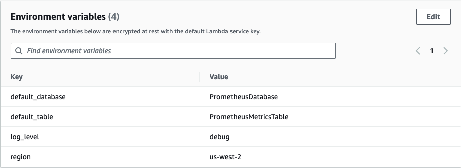

# Amazon Timestream Prometheus Connector
The Prometheus Connector receives and sends time series data between Prometheus and Amazon Timestream through Prometheus' [remote write and remote read](https://prometheus.io/docs/prometheus/latest/storage/#remote-storage-integrations) protocols.

# Table of contents
- [Prerequisites](#prerequisites)
- [User Documentation](#user-documentation)
  - [Quick Start](#quick-start)
  - [Advanced Options](#advanced-options)
    - [Prometheus Configuration](#prometheus-configuration)
    - [Run with One-Click Deployment](#run-with-one-click-deployment)
    - [Run with Precompiled Binaries](#run-with-precompiled-binaries)
    - [Run with Docker Image](#run-with-docker-image)
    - [Run with AWS Lambda](#run-with-aws-lambda)
    - [Start Prometheus](#start-prometheus)
  - [Configuration Options](#configuration-options)
    - [Standard Configuration Options](#standard-configuration-options)
    - [Retry Configuration Options](#retry-configuration-options)
    - [Logger Configuration Options](#logger-configuration-options)
  - [Relabel Long Labels](#relabel-long-labels)
  - [Authentication](#authentication)
- [Developer Documentation](#developer-documentation)
  - [Building the Prometheus Connector from Source](#building-the-prometheus-connector-from-source)
  - [Building the Docker Image](#building-the-docker-image)
  - [Creating Self-signed TLS Certificates](#creating-self-signed-tls-certificates)
    - [Creating the Certificate Authority files](#creating-the-certificate-authority-files)
    - [Creating the Server Key and Server Certificate](#creating-the-server-key-and-server-certificate)
- [Troubleshooting](#troubleshooting)
  - [Prometheus Connector Specific Errors](#prometheus-connector-specific-errors)
  - [Write API Errors](#write-api-errors)
  - [Query API Errors](#query-api-errors)
- [Limitations](#limitations)
  - [Maximum Prometheus Samples Per Remote Write Request](#maximum-prometheus-samples-per-remote-write-request)
- [Caveats](#caveats)
  - [Unsupported SigV4 Authentication](#unsupported-sigv4-authentication)
  - [Unsupported Temporary Security Credentials](#unsupported-temporary-security-credentials)
  - [Unsupported RE2 Syntax](#unsupported-re2-syntax)
  - [Inaccurate Prometheus Metrics](#inaccurate-prometheus-metrics)
- [License](#license)

# Prerequisites

1. **Sign up for AWS** &mdash; Before beginning, have an AWS account. For more information about creating an AWS account and retrieving your AWS credentials, see [Signing Up for AWS](https://docs.aws.amazon.com/timestream/latest/developerguide/accessing.html#SettingUp.Q.SignUpForAWS).
2. **Amazon Timestream**  &mdash; Have databases and tables created on Amazon Timestream. To create databases and tables on Amazon Timestream, see [Accessing Timestream](https://docs.aws.amazon.com/timestream/latest/developerguide/accessing.html).
3. **Minimum requirements** &mdash; The Amazon Timestream Prometheus Connector for Go requires **Go 1.14** or later.
4. **Prometheus** &mdash; Download Prometheus from their [Download](https://prometheus.io/download/) page. To learn more about Prometheus, see their [introduction documentation](https://prometheus.io/docs/introduction/overview/).
5. **Docker** &mdash; Docker is only required when building or running the Docker image. To download Docker, see [Get Started with Docker](https://www.docker.com/get-started).

# User Documentation

## Quick Start

1. [Prerequisites](#prerequisites) are met.
2. [Prometheus is configured](#prometheus-configuration), minimum version `2.0.0`.
3. Deploy with one click deployment: [serverless/DEVELOPER_README.md#deployment](serverless/DEVELOPER_README.md#deployment).
4. Update `remote_read` and `remote_write` values in `prometheus.yml` to the resources created by the deployment: [serverless/DEVELOPER_README.md#configure-prometheus](serverless/DEVELOPER_README.md#configure-prometheus).
5. [Verify the Prometheus connector is working](#verification).

## Advanced Options

The Prometheus Connector is available in the following formats:
- [**One-click deployment**](#run-with-one-click-deployment).
- [**Precompiled binaries**](#run-with-precompiled-binaries).
- [**Docker image**](#run-with-docker-image).
- [**A `zip` archive of the precompiled binary for Linux that can be integrated with AWS Lambda**](#run-with-aws-lambda).

### Prometheus Configuration

To configure Prometheus to read and write to remote storage, configure the `remote_read` and `remote_write` sections in `prometheus.yml`. To learn more, see the [remote read](https://prometheus.io/docs/prometheus/latest/configuration/configuration/#remote_read) and [remote write](https://prometheus.io/docs/prometheus/latest/configuration/configuration/#remote_write) sections on Prometheus' configuration page.

> **NOTE**: It is recommended to use the default number of samples per write request through `max_samples_per_send`. For more details see [Maximum Prometheus Samples Per Remote Write Request](#maximum-prometheus-samples-per-remote-write-request).

1. Configure Prometheus' remote read and remote write destination by setting the `url` options to the Prometheus Connector's listening URLs, e.g. `"http://localhost:9201/write"`.

2. Configure the basic authentication header for Prometheus read and write requests with valid IAM credentials.

   > **NOTE**: All configuration options are *case-sensitive*, and *session_token* authentication parameter is not supported for MFA authenticated AWS users.

    ```yaml
    basic_auth:
      username: accessKey
      password: secretAccessKey
    ```

   Prometheus also supports passing the password as a file, the following example has the IAM secret access key stored in secret.txt in the credentials folder:

    ```yaml
    basic_auth:
      username: accessKey
      password_file: /Users/user/Desktop/credentials/secretAccessKey.txt
    ```

   The *password_file* path must be the absolute path for the file, and the password file must contain only the value for the *aws_secret_access_key*.

   >  **NOTE**: As a security best practice, it is recommended to regularly [rotate IAM user access keys](https://docs.aws.amazon.com/IAM/latest/UserGuide/id_credentials_access-keys.html#Using_RotateAccessKey).

3. It is recommended to secure the Prometheus requests with TLS encryption. This can be achieved by specifying the certificate authority file in the `tls_config` section for Prometheus' remote read and remote write configuration. To generate self-signed certificates during development see the [Creating Self-signed TLS Certificates](#creating-self-signed-tls-certificates) section.

   Here is an example of `remote_write` and `remote_read` configuration with TLS, where `RootCA.pem` is within the same directory as the Prometheus configuration file:

   > **NOTE**: All configuration options are *case-sensitive*, and *session_token* authentication parameter is not supported for MFA authenticated AWS users.

    ```yaml
    remote_write:
      - url: "https://localhost:9201/write"
    
        tls_config:
          # Ensure ca_file is a valid file path pointing to the CA certificate.
          ca_file: RootCA.pem
  
        basic_auth:
          username: accessKey
          password: secretAccessKey

    remote_read:
      - url: "https://localhost:9201/read"
    
        basic_auth:
            username: accessKey
            password: secretAccessKey
    
        tls_config:
            # Ensure ca_file is a valid file path pointing to the CA certificate.
            ca_file: RootCA.pem
    ```

   See a full example without TLS configuration in [simple-example.yml](./documentation/example/simple-example.yml).

### Run with One-Click Deployment

See [`serverless/DEVELOPER_README.md`](serverless/DEVELOPER_README.md) for serverless deployments, which includes one-click deployment links for CloudFormation.

This is the easiest and recommended method for running the connector.

### Run with Precompiled Binaries

The pre-compiled binaries independent of platform will have the name `bootstrap` to align with the `provided.al2023` lambda runtime naming convention. Run the precompiled binaries with required arguments `default-database`, `default-table`. Specify the `region` argument if your Timestream database is not in `us-east-1`, as that is the default value for the target region.

`./bootstrap --default-database=prometheusDatabase  --default-table=prometheusMetricsTable --region=us-west-2`

It is recommended to secure the Prometheus requests with TLS encryption. To enable TLS encryption:

1. Specify the server certificate and the server private key through the `tls-certificate` and `tls-key` configuration options. An example for macOS is as follows:

   ```shell
   ./bootstrap \
   --default-database=prometheusDatabase \
   --default-table=prometheusMetricsTable \
   --region=us-west-2 \
   --tls-certificate=serverCertificate.crt \
   --tls-key=serverPrivateKey.key
   ```

2. Ensure the certificate authority file has been specified in the `tls_config` section within Prometheus' configuration file, see [Prometheus Configuration](#prometheus-configuration) for an example.

To generate self-signed certificates during development see [Creating Self-signed TLS Certificates](#creating-self-signed-tls-certificates).

For more examples on configuring the Prometheus Connector see [Configuration Options](#configuration-options).

#### Running Precompiled Binary for macOS

The following error message may show up when running the precompiled binary on macOS:

`"bootstrap" cannot be opened because the developer cannot be verified.`

Follow these steps to resolve:

1. Choose `Apple menu` > `System Preferences`.
2. Select `Security & Privacy`.
3. Under the `General` tab, select `Open Anyway`.

### Run with Docker Image
Load the Docker image by the following command:
```shell script
docker load < timestream-prometheus-connector-docker-image-1.0.0.tar.gz
```

- **Linux and macOS**

  ```shell
  docker run \
  -p 9201:9201 \
  timestream-prometheus-connector-docker \
  --default-database=prometheusDatabase \
  --default-table=prometheusMetricsTable
  ```

- **Windows**

  ```shell
  docker run ^
  -p 9201:9201 ^
  timestream-prometheus-connector-docker ^
  --default-database=prometheusDatabase ^
  --default-table=prometheusMetricsTable
  ```

It is recommended to secure the Prometheus requests with HTTPS with TLS encryption. To enable TLS encryption:

1. Mount the volume containing the server certificate and the server private key to a volume on the Docker container, then specify the path to the certificate and the key through the `tls-certificate` and `tls-key` configuration options. Note that the path specified must be with respect to the Docker container.

   In the following examples, server certificate and server private key are stored in the `$HOME/tls` directory on Linux and macOS or `%USERPROFILE%/tls` on Windows, but are mounted to `/root/tls` on the Docker container:

   - **Linux and macOS**

     ```shell
     docker run \
     -v $HOME/tls:/root/tls:ro \
     -p 9201:9201 \
     timestream-prometheus-connector-docker \
     --default-database=prometheusDatabase \
     --default-table=prometheusMetricsTable \
     --tls-certificate=/root/tls/serverCertificate.crt \
     --tls-key=/root/tls/serverPrivateKey.key
     ```

   - **Windows**

     ```shell
     docker run ^
     -v "%USERPROFILE%/tls:/root/tls/:ro" ^
     -p 9201:9201 ^
     timestream-prometheus-connector-docker ^
     --default-database=prometheusDatabase ^
     --default-table=prometheusMetricsTable ^
     --tls-certificate=/root/tls/serverCertificate.crt ^
     --tls-key=/root/tls/serverPrivateKey.key
     ```

2. Ensure the certificate authority file has been specified in the `tls_config` section within Prometheus' configuration file, see [Prometheus Configuration](#prometheus-configuration) for an example.

To generate self-signed certificates during development see [Creating Self-signed TLS Certificates](#creating-self-signed-tls-certificates).

To configure the `web.listen-address` option when running the Prometheus Connector through a Docker image, use the `-p` flag to expose the custom endpoint. The following example listens on the custom endpoint `localhost:3080`:

- **Linux and macOS**

  ```shell
  docker run \
  -p 3080:3080 \
  timestream-prometheus-connector-docker \
  --default-database=prometheusDatabase \
  --default-table=prometheusMetricsTable \
  --web.listen-address=:3080
  ```

- **Windows**

  ```shell
  docker run ^
  -p 3080:3080 ^
  timestream-prometheus-connector-docker ^
  --default-database=prometheusDatabase ^
  --default-table=prometheusMetricsTable ^
  --web.listen-address=:3080
  ```

For more information regarding the `-p` flag see the [official Docker documentation](https://docs.docker.com/engine/reference/commandline/run/#publish-or-expose-port--p---expose).

### Run with AWS Lambda
Running the Prometheus Connector on AWS Lambda allows for a serverless workflow. This section details the steps to configuring the IAM permissions to integrate the Prometheus Connector with Amazon API Gateway and AWS Lambda.

#### IAM Role and Policy Configuration

1. Open the [AWS management console](https://console.aws.amazon.com/iam/) for IAM.

2. Click on `Policies` and select `Create policy`.

3. Select the `JSON` tab and paste the following policy to provide basic permissions for the Lambda function to output logs to Cloudwatch:

   ```json
    {
        "Version": "2012-10-17",
        "Statement": [
            {
                "Effect": "Allow",
                "Action": [
                    "logs:CreateLogGroup",
                    "logs:CreateLogStream",
                    "logs:PutLogEvents"
                ],
                "Resource": "arn:aws:logs:${AWS::Region}:${AWS::AccountId}:log-group:/aws/lambda/${LambdaFunctionName}:*"
            }
        ]
    }
   ```

4. Update the values for `${AWS::Region}`, `${AWS::AccountId}`, `${LambdaFunctionName}` in the following policy. An example of the updated value for `Resource` would be:
    `"Resource": "arn:aws:logs:us-east-1:12345678:log-group:/aws/lambda/timestream-prometheus-connector:*"`. 

5. Click `Next`.

6. Enter a policy name.

7. Click on `Create policy`

8. Click on `Roles`.

9. Click on `Create role`

10. Click on `Custom trust policy`.

11. Paste the following to `Policy Document` to allow API gateway to access the policy.

     ```json
     {
       "Version": "2012-10-17",
       "Statement": [
         {
           "Effect": "Allow",
           "Principal": {
             "Service": [
               "apigateway.amazonaws.com",
               "lambda.amazonaws.com"
             ]
           },
           "Action": "sts:AssumeRole"
         }
       ]
     }
     ```

12. Click on `Next`

13. Select the policy that you previously created which gives the lambda function basic permissions to output logs to Cloudwatch.

15. Click `Next`.

16. Enter a name for the role, in this example will use `LambdaTimestreamFullAccessRole`.

17. Click on `Create role`.

18. After creating the role successfully, click `Roles` under `Access management` and choose the role created to see the details.

18. Take note of the `Role ARN`, this is required when creating a policy to allow the current user access to the role.

To provide access to this newly-created role, add a permission to the current user with the following steps:
1. Open the [AWS management console](https://console.aws.amazon.com/iam/) for IAM.
2. Under `Access management`, click `Users`.
3. Select the user that needs access to this role.
4. Click `Add permissions`.
5. Select `Attach existing policies directly`.
6. Click `Create policy`.
7. Switch to the `JSON` tab, and paste the following to provide the user with the permission to `PassRole` on the newly-created role, where `role_arn` can be on the `Summary` page of the newly-created role:

   ```json
   {
       "Version": "2012-10-17",
       "Statement": [
           {
               "Sid": "PolicyStatementToAllowUserToPassOneSpecificRole",
               "Effect": "Allow",
               "Action": [
                   "iam:PassRole"
               ],
               "Resource": "role_arn"
           }
       ]
   }
   ```

8. Click `Next`.
9. Enter a policy name.
10. Click `Create policy`.
11. Attach the policy to the user.

#### Create the AWS Lambda Function

1. Open the [AWS management console](https://console.aws.amazon.com/lambda/) for AWS Lambda.
2. Click `Create function`.
3. Enter a function name, this example will use `PrometheusConnector` as the function name.
4. Choose `Amazon Linux 2023` from the Runtime dropdown.
5. Expand `Change default execution role`.
6. Select `Use an existing role`.
7. Choose the newly-created role from the dropdown, for this example it will be `LambdaTimestreamFullAccessRole`.
8. Click `Create function`.

#### Configure the AWS Lambda Function

1. Open the [AWS management console](https://console.aws.amazon.com/lambda/) for AWS Lambda.
2. Select the newly-created function, in this example it will be `PrometheusConnector`.
3. Under the `code` section, click `Upload from`.
4. Select `.zip file`.
5. Upload the ZIP file containing the precompiled Linux binary, which can be downloaded from the [latest releases](https://github.com/awslabs/amazon-timestream-connector-prometheus/releases).
6. Click `save`.
7. Click on `Configuration`.
8. Under the `Environment variables` section, click `Edit`.
9. Enter the key and corresponding value of environment variables `default_database`, `default_table`, which are required, and `region` will default to `us-east-1` if not populated. Here is an example:

Go to [Configuration Options](#configuration-options) to see more information.
10. Click on `Save`
11. Click on `Code`.
12. Click `Edit` in the `Runtime settings` section.
13. In the `Handler` section, enter the name of the Amazon Timestream Prometheus Connector ZIP file, which will be `bootstrap`.
14. Click `Save`.

#### Create the API on Amazon API Gateway

1. Open the [AWS management console](https://console.aws.amazon.com/apigateway/) for API Gateway.
2. Click `Create API`.
3. Click `Build` under `HTTP API`.
4. Click `Add integration` and choose `Lambda`.
5. Choose the appropriate `AWS Region`.
6. Type in the name of the Lambda function created in the previous step [Create the AWS Lambda Function](#create-the-aws-lambda-function) or paste in the function's ARN. For this example, the value will be `PrometheusConnector`.
7. Click `Add integration`.
8. Type in an `API name`, this example will use `PrometheusConnectorAPI` as the API name.
9. Click `Next`.
10. There will be a pre-defined route `ANY /PrometheusConnector -> PrometheusConnector(Lambda)`, remove this route.
11. Click `Add route` to add a new route for **remote write**.
   1. Choose `POST` for the `Method`.
   2. Enter `/write`for the Resource Path.
   3. Select the appropriate Lambda function as the integration target, in this example it would be `PrometheusConnector`.
12. Click `Add route` to add a new route for **remote read**.
   1. Choose `POST` for the `Method`.
   2. Enter `/read` for the Resource Path.
   3. Select the appropriate Lambda function as the integration target, in this example it would be `PrometheusConnector`.
13. Click `Next`.
14. Remove the `default` stage.
15. Click `Add stage`.
16. Enter a name for the stage, in this example we will use `dev`.
17. Click the `Auto-deploy` button and click `Next`.
18. Click `Create`.
19. Select the newly-created API Gateway and take note of the invoke URL, this URL is required to set up Prometheus' remote read and write URL.
20. It is highly recommended having TLS encryption enabled during production. See [Configuring mutual TLS authentication for an HTTP API](https://docs.aws.amazon.com/apigateway/latest/developerguide/http-api-mutual-tls.html).

#### Configure Prometheus for AWS Lambda

The process to configure Prometheus for AWS Lambda requires the same steps listed in [Prometheus Configuration](#prometheus-configuration). 

> **NOTE**: Ensure the remote write and the remote read URLs are set to the invoke URLS.

The following example points the remote write and the remote read URLs to an API with ID foo9l30 and the deployment stage `dev`. 
It is highly recommended having TLS encryption enabled during production, the following example also specifies the root certificate authority file for TLS encryption, which requires configuring the TLS encryption on API Gateway. See [Configuring mutual TLS authentication for an HTTP API](https://docs.aws.amazon.com/apigateway/latest/developerguide/http-api-mutual-tls.html).
```YAML
remote_write:
  - url: "https://foo9l30.execute-api.us-east-1.amazonaws.com/dev/write"
      
    tls_config:
      # Ensure ca_file is a valid file path pointing to the CA certificate.
      ca_file: RootCA.pem

remote_read:
  - url: "https://foo9l30.execute-api.us-east-1.amazonaws.com/dev/read"
  
    tls_config:
      # Ensure ca_file is a valid file path pointing to the CA certificate.
      ca_file: RootCA.pem
```

#### Configure Logging for API Gateway (Optional)

To configure logging for API Gateway to CloudWatch, a new CloudWatch log group needs to be created.

1. Open the [AWS management console](https://console.aws.amazon.com/cloudwatch/) for CloudWatch.
2. Click the `Log groups` under `Log` in the sidebar.
2. Select `Create log group`.
3. Enter a group name and click `Create`.
4. Select the newly-created log group from the list of log groups to see the log group details.
5. Take note of the ARN.

Next, open the previously created Prometheus Connector API on [API Gateway]( https://console.aws.amazon.com/apigateway/main/apis) to configure logging.

1. Select `Logging` under the `Monitor` section on the left-hand side.
2. Select a stage from the dropdown and click `Next`.
3. Click `Edit`.
4. Toggle `Access logging`.
5. Paste the ARN of the newly-created log group.
6. Select the preferred log format.
7. Click `Save`.

If permissions are required, add the following policy to the IAM account with `region` and `account-id` updated to the appropriate values:

```json
{
    "Version": "2012-10-17",
    "Statement": [
        {
            "Effect": "Allow",
            "Action": [
                "logs:DescribeLogGroups",
                "logs:DescribeLogStreams",
                "logs:GetLogEvents",
                "logs:FilterLogEvents"
            ],
            "Resource": "arn:aws:logs:region:account-id:log-group:*"
        },
        {
            "Effect": "Allow",
            "Action": [
                "logs:CreateLogDelivery",
                "logs:PutResourcePolicy",
                "logs:UpdateLogDelivery",
                "logs:DeleteLogDelivery",
                "logs:CreateLogGroup",
                "logs:DescribeResourcePolicies",
                "logs:GetLogDelivery",
                "logs:ListLogDeliveries"
            ],
            "Resource": "*"
        }
    ]
}
```

For more information see [Configuring logging for an HTTP API](https://docs.aws.amazon.com/apigateway/latest/developerguide/http-api-logging.html).

#### View Logs on CloudWatch

A log group will automatically be created when creating a new AWS Lambda function.
The name of log group is usually in the following format: the log group named in format `/aws/lambda/{LambdaFunctionName}`.
To view the logs from the Prometheus Connector:

1. Open the [AWS management console](https://console.aws.amazon.com/cloudwatch/) for CloudWatch.
2. Click `Log groups` under `Logs`.
3. Select the log group for the Prometheus Connector. In this example it would be `/aws/lambda/PrometheusConnector` and here is an example of the log streams within:


### Start Prometheus
Start Prometheus by running the command: `./prometheus --config.file=prometheus.yml`.

## Configuration Options

>**NOTE**: All configuration options keys are *case-sensitive*

When running the Prometheus Connector on AWS Lambda, configuration options need to be set as Lambda environment variables.

### Standard Configuration Options

The default-database name and default-table name are required for data ingestion and data retrieval. If they are not provided, the Prometheus Connector will return a 400 Bad Request to the caller.

| Standalone Option | Lambda Option      | Description                                                                                                                                                                       | Required | Default Value |
|--------|--------------------|-----------------------------------------------------------------------------------------------------------------------------------------------------------------------------------|---------|---------|
| `default-database` | `default_database` | The Prometheus default database name.                                                                                                                                             | No | `None` |
| `default-table` | `default_table`    | The Prometheus default table name.                                                                                                                                                | No | `None` |
| `region` | `region` | The signing region for the Amazon Timestream service.                                                                                                                             | No | `us-east-1` |
| `tls-certificate`    | `N/A`            | The path to the TLS server certificate file. This is required to enable HTTPS. If unspecified, HTTP will be used.                                                                 | No          | `None`        |
| `tls-key`            | `N/A`            | The path to the TLS server private key file. This is required to enable HTTPS. If unspecified, HTTP will be used.                                                                 | No          | `None`        |
| `web.listen-address` | `N/A` | The endpoint to listen to for write and read requests sent from Prometheus.                                                                                              | No | `:9201` |
| `web.telemetry-path` | `N/A` | The path containing metrics collected by the Prometheus Connector, such as `ignoredSamples`. This allows Prometheus to scrape and monitor data from the specified telemetry-path. | No | `/metrics` |

> **NOTE**: `web.listen-address` and `web.telemetry-path` configuration options are not available when running the Prometheus Connector on AWS Lambda.

#### Configuration Examples

1. Configure the Prometheus Connector to access the Amazon Timestream service in the US West (Oregon) Region instead of the default US East (N. Virginia) Region.
    
   | Runtime              | Command                                                                                                                                                                                             |
   | -------------------- |-----------------------------------------------------------------------------------------------------------------------------------------------------------------------------------------------------|
   | Precompiled Binaries | `./bootstrap --default-database=PrometheusDatabase  --default-table=PrometheusMetricsTable --region=us-west-2`                                              |
   | AWS Lambda Function  | `aws lambda update-function-configuration --function-name PrometheusConnector --environment "Variables={default_database=prometheusDatabase,default_table=prometheusMetricsTable,region=us-west-2}"` |

2. Configure the Prometheus Connector listen for requests on an HTTPS server `https://localhost:9201` with TLS encryption.

   | Runtime              | Command                                                                                                                                                                                                    |
   | -------------------- |------------------------------------------------------------------------------------------------------------------------------------------------------------------------------------------------------------|
   | Precompiled Binaries | `./bootstrap --default-database=PrometheusDatabase  --default-table=PrometheusMetricsTable --tls-certificate=serverCertificate.crt --tls-key=serverPrivateKey.key` |
   | AWS Lambda Function  | `N/A`                                                                                                                                                                                                      |

3. Configure the Prometheus Connector to listen for Prometheus requests on `http://localhost:3080`.

   | Runtime              | Command                                                                                                                                                        |
   | -------------------- |----------------------------------------------------------------------------------------------------------------------------------------------------------------|
   | Precompiled Binaries | `./bootstrap --default-database=PrometheusDatabase  --default-table=PrometheusMetricsTable --web.listen-address=:3080` |
   | AWS Lambda Function  | `N/A`                                                                                                                                                          |

4. Configure the Prometheus Connector to listen for Prometheus requests on `http://localhost:3080` and serve collected metrics to `http://localhost:3080/timestream-metrics`.

   | Runtime              | Command                                                                                                                                                                                                 |
   | -------------------- |---------------------------------------------------------------------------------------------------------------------------------------------------------------------------------------------------------|
   | Precompiled Binaries | `./bootstrap --default-database=PrometheusDatabase  --default-table=PrometheusMetricsTable --web.listen-address=:3080 --web.telemetry-path=/timestream-metrics` |
   | AWS Lambda Function  | `N/A`                                                                                                                                                                                                   |

### Retry Configuration Options

The Prometheus Connector exposes the query SDK's retry configurations for users.

| Standalone OptionOption | Lambda Option | Description | Is Required | Default Value |
|--------|-------------|------------|---------|---------|
| `max-retries` | `max_retries` |  The maximum number of times the read request will be retried for failures. | No | 3 |

#### Configuration Examples

Configure the Prometheus Connector to retry up to 10 times upon recoverable errors.

| Runtime              | Command                                                                                                                                                                                           |
| -------------------- |---------------------------------------------------------------------------------------------------------------------------------------------------------------------------------------------------|
| Precompiled Binaries | `./bootstrap --default-database=PrometheusDatabase  --default-table=PrometheusMetricsTable --max-retries=10`                                              |
| AWS Lambda Function  | `aws lambda update-function-configuration --function-name PrometheusConnector --environment "Variables={default_database=prometheusDatabase,default_table=prometheusMetricsTable,max_retries=10}"` |

### Logger Configuration Options

| Standalone Option | Lambda Option | Description | Required | Default Value | Valid Values |
|--------|-------------|------------|---------|--------------|--------------|
| `enable-logging` | `enable_logging` | Enables or disables logging in the Prometheus Connector. | No | `true` | `1`, `t`, `T`, `TRUE`, `true`, `True`, `0`, `f`, `F`, `FALSE`, `false`, `False` |
| `fail-on-long-label` | `fail_on_long_label` | Enables or disables the option to halt the program immediately when a Prometheus Label name exceeds 256 bytes. | No | `false` | `1`, `t`, `T`, `TRUE`, `true`, `True`, `0`, `f`, `F`, `FALSE`, `false`, `False` |
| `fail-on-invalid-sample-value` | `fail_on_invalid_sample_value` |  Enables or disables the option to halt the program immediately when a Sample contains a non-finite float value. | No | `false` | `1`, `t`, `T`, `TRUE`, `true`, `True`, `0`, `f`, `F`, `FALSE`, `false`, `False` |
| `log.level` | `log_level` |  Sets the output level for logs. | No | `info` | `info`, `warn`, `debug`, `error` |
| `log.format` | `log_format` |  Sets the output format for the logs. The output for logs always goes to stderr, unless the logging has been disabled. | No | `logfmt` | `logfmt`, `json` |

>**NOTE**: The logging level is ***by default*** set to `info`. Set `log.level` to `debug` to view any Samples ignored due to long metric name or non-finite values.

`fail-on-long-label` &mdash; Prometheus recommends using meaningful and detailed metrics names, which may result in metric names exceeding the maximum length (256 bytes) supported by Amazon Timestream.
If a Prometheus time series has a metric name exceeding the maximum supported length, the Prometheus Connector will **by default** log and ignore the Prometheus time series. 
To quickly spot and resolve issues that may be caused by ignored Prometheus time series during development, set `fail-on-long-label` flag to `true`, and the Prometheus Connector will log and halt on a long metric name.

`fail-on-invalid-sample-value` &mdash; If the Prometheus WriteRequest contains time series with non-finite float values such as NaN, -Inf, or Inf, the Prometheus Connector will *by default* log and ignore any of those time series.
To quickly spot and resolve issues that may be caused by ignored Prometheus time series during development, set `fail-on-invalid-sample-value` flag to `true`, and the Prometheus Connector will log and halt on a Prometheus time series with non-finite float values. `fail-on-long-label` and `fail-on-invalid-sample-value` configurations are not recommended during production operation.

#### Configuration Examples

1. Disable logging in the Prometheus Connector.

   | Runtime              | Command                                                                                                                                                                                                            |
   | -------------------- |--------------------------------------------------------------------------------------------------------------------------------------------------------------------------------------------------------------------|
   | Precompiled Binaries | `./bootstrap --default-database=PrometheusDatabase  --default-table=PrometheusMetricsTable --enable-logging=false`                                                         |
   | AWS Lambda Function  | `aws lambda update-function-configuration --function-name PrometheusPrometheus Connector --environment "Variables={default_database=prometheusDatabase,default_table=prometheusMetricsTable,enable_logging=false}"` |

2. Toggle the Prometheus Connector to halt on: <br />- label names exceeding the maximum length supported by Amazon Timestream;<br />- Prometheus time series with non-finite values.

   | Runtime              | Command                                                                                                                                                                                                                                                           |
   | -------------------- |-------------------------------------------------------------------------------------------------------------------------------------------------------------------------------------------------------------------------------------------------------------------|
   | Precompiled Binaries | `./bootstrap --default-database=PrometheusDatabase  --default-table=PrometheusMetricsTable --fail-on-long-label=true --fail-on-invalid-sample=true` |
   | AWS Lambda Function  | `aws lambda update-function-configuration --function-name PrometheusConnector --environment "Variables={default_database=prometheusDatabase,default_table=prometheusMetricsTable,fail_on_long_label=true, fail_on_invalid_sample_value=true}"`                     |

3. Configure the Prometheus Connector to output the logs at debug level and in JSON format.

    | Runtime              | Command                                                                                                                                                                                                             |
    | -------------------- |---------------------------------------------------------------------------------------------------------------------------------------------------------------------------------------------------------------------|
    | Precompiled Binaries | `./bootstrap --default-database=PrometheusDatabase  --default-table=PrometheusMetricsTable --log.level=debug --log.format=json`                                             |
    | AWS Lambda Function  | `aws lambda update-function-configuration --function-name PrometheusConnector --environment "Variables={default_database=prometheusDatabase,default_table=prometheusMetricsTable,log_level=debug, log_format=json}"` |

## Relabel Long Labels

If a Prometheus time series has a metric name exceeding the maximum supported length, the Prometheus Connector will **by default** log and ignore any of those Samples.

Long metric names will be logged by the Prometheus Connector, one can use the `write_relabel_configs` in `prometheus.yml` to rename a long metric name.
Below is an example `prometheus.yml` relabeling the long metric name `prometheus_remote_storage_read_request_duration_seconds_bucket` to `prometheus_read_request_duration_seconds_bucket`.

```yaml
global:
  scrape_interval:    60s
  evaluation_interval: 60s 

scrape_configs:
  - job_name: 'prometheus'

    static_configs:
    - targets: ['localhost:9090']

remote_write:
  - url: "http://localhost:9201/write"

    write_relabel_configs:
    - source_labels: ["__name__"]
      action: replace
      regex: prometheus_remote_storage_read_request_duration_seconds_bucket
      replacement: prometheus_read_request_duration_seconds_bucket
      target_label: __name__

remote_read:
  - url: "http://localhost:9201/read"
```

## Authentication

The Prometheus Connector will use the default credentials provider implemented in the AWS SDK for Go instead of allowing users 
to provide the credentials through command-line flags. This prevents sensitive data from being easily scraped.

## User-Agent Header

The Prometheus Connector uses the following `User-Agent` header for all requests:

```
User-Agent: Prometheus Connector/<version> aws-sdk-go/<version> (go<version>; <os>; <cpu arch>)
```

## Verification

1. To verify Prometheus is running, open `http://localhost:9090/` in a browser, this opens Prometheus' [expression browser](https://prometheus.io/docs/visualization/browser/#expression-browser).

2. To verify the Prometheus Connector is ready to receive requests, ensure the following log message is printed. See the [Troubleshooting](#troubleshooting) section for other error messages.


   ```log
   level=info ts=2020-11-21T01:06:49.188Z caller=utils.go:33 message="Timestream <write/query> connection is initialized (Database: <database-name>, Table: <table-name>, Region: <region>)"
   ```

3. To verify the Prometheus Connector is ingesting data, use the AWS CLI to execute the following query:

    ```shell
    aws timestream-query query --query-string "SELECT count() FROM prometheusDatabase.prometheusMetricsTable"
    ```

    The output should look similar to the following:

    ```json
    {
        "Rows": [
            {
                "Data": [
                    {
                        "ScalarValue": "340"
                    }
                ]
            }
        ],
        "ColumnInfo": [
            {
                "Name": "_col0",
                "Type": {
                    "ScalarType": "BIGINT"
                }
            }
        ],
        "QueryId": "AEBQEAMYNBGX7RA"
    }
    ```

    This sample output indicates that 340 rows has been ingested.
   
4. To verify the Prometheus Connector can query data from Amazon Timestream, visit `http://localhost:9090/` in a browser, which opens Prometheus' [expression browser](https://prometheus.io/docs/visualization/browser/#expression-browser), and execute a Prometheus Query Language (PromQL) query.
   The PromQL query will use the values of `default-database` and `default-table` as the corresponding database and table that contains data. Here is a simple example:

   ```
   prometheus_http_requests_total{}
   ```

   `prometheus_http_requests_total` is a metric name. The database and table being queried are the corresponding `default-database` and `default-table` configured for the Prometheus connector.
   This PromQL will return all the time series data from the past hour with the metric name `prometheus_http_requests_total` in `default-table` of `default-database`.
   Here is a query result example:
   
   
   PromQL also supports regex, here is an example:
   ```
   prometheus_http_requests_total{handler!="/api/v1/query", job=~"p*", code!~"2..", prometheusDatabase="prometheusDatabase", prometheusMetricsTable="prometheusMetricsTable"}
   ```
   This example queries all rows from `prometheusMetricsTable` of `prometheusDatabase` where:
  
   - column `metric name` equals to `prometheus_http_requests_total`;
   - column `handler` does not equal to `/api/v1/query`;
   - column `job` matches the regex pattern `p*`;
   - column `code` does not match the regex pattern `2..`.
  
   For more examples, see [Prometheus Query Examples](https://prometheus.io/docs/prometheus/latest/querying/examples/).
   There are other ways to execute PromQLs, such as through Prometheus' [HTTP API](https://prometheus.io/docs/prometheus/latest/querying/api/), or through [Grafana](https://grafana.com/).

# Developer Documentation

## Building the Prometheus Connector from Source
1. Ensure to download all the dependencies, run the command: `go get -u -v -f all`.
2. Use the command to build the program: `go build`.
3. Now, proceed from the [Prometheus Configuration](#prometheus-configuration) section in User Documentation to run the connector.

## Building the Docker Image
1. Navigate to the repository’s root directory on a command-line interface.
2. Run the following command to build the image: `docker buildx build . -t timestream-prometheus-connector-docker`.

## Creating Self-signed TLS Certificates

The following steps generate self-signed TLS certificates using OpenSSL.

> **NOTE**: Self-signed certificates **should not** be used during production, they should only be used during development.

### Creating the Certificate Authority files

Use the following command to generate a private key and the root certificate file for the certificate authority.

```shell
openssl req -x509 -nodes -new -sha256 -days 365 -newkey rsa:2048 -keyout RootCA.key -out RootCA.pem
```

This command will prompt the user to enter some information for the certificate. An example of the output is as follows:

```shell
certificates ❯ openssl req -x509 -nodes -new -sha256 -days 365 -newkey rsa:2048 -keyout RootCA.key -out RootCA.pem
Generating a 2048 bit RSA private key
............................+++
................+++
writing new private key to 'RootCA.key'
-----
You are about to be asked to enter information that will be incorporated
into your certificate request.
What you are about to enter is what is called a Distinguished Name or a DN.
There are quite a few fields but you can leave some blank
For some fields there will be a default value,
If you enter '.', the field will be left blank.
-----
Country Name (2 letter code) []:US
State or Province Name (full name) []:Washington
Locality Name (eg, city) []:Seattle
Organization Name (eg, company) []:Amazon Web Services
Organizational Unit Name (eg, section) []:
Common Name (eg, fully qualified host name) []:Private-Root-CA
Email Address []:
certificates ❯ 
```

To provide all the information directly with the `-subj` flag. An example is as follows:

```shell
openssl req -x509 -nodes -new -sha256 -days 365 -newkey rsa:2048 -keyout RootCA.key -out RootCA.pem -subj "/C=US/ST=Washington/L=Seattle/O=Amazon Web Services/CN=Private-Root-CA"
```

### Creating the Server Key and Server Certificate

Use the following command to generate a server private key and a certificate signing request:

```shell
openssl req -days 365 -nodes -newkey rsa:2048 -keyout serverPrivateKey.key -out serverCertificateSigningRequest.csr
```

This command will prompt the user to enter some information for the certificate. An example of the output is as follows:

```shell
certificates ❯ openssl req -days 365 -nodes -newkey rsa:2048 -keyout serverPrivateKey.key -out serverCertificateSigningRequest.csr
Generating a 2048 bit RSA private key
....................................................................................................................................................................................................+++
........................+++
writing new private key to 'serverPrivateKey.key'
-----
You are about to be asked to enter information that will be incorporated
into your certificate request.
What you are about to enter is what is called a Distinguished Name or a DN.
There are quite a few fields but you can leave some blank
For some fields there will be a default value,
If you enter '.', the field will be left blank.
-----
Country Name (2 letter code) []:US
State or Province Name (full name) []:Washington
Locality Name (eg, city) []:Seattle
Organization Name (eg, company) []:Amazon Web Services
Organizational Unit Name (eg, section) []:
Common Name (eg, fully qualified host name) []:localhost
Email Address []:
certificates ❯ 
```

To provide all the information directly with the `-subj` flag. An example is as follows:

```shell
openssl req -days 365 -nodes -newkey rsa:2048 -keyout serverPrivateKey.key -out serverCertificateSigningRequest.csr -subj "/C=US/ST=Washington/L=Seattle/O=Amazon Web Services/CN=localhost"
```

To associate the host name to the server certificate, create a `domain.ext` file with the following content:
```
subjectAltName = DNS:localhost
```
Store the file at the same location as the `serverCertificateSigningRequest.csr`. This `domain.ext` will be used when generating the self-signed server certificate.

> **NOTE**: The value for DNS is set to **localhost**. This is required when running the Prometheus Connector from a Docker image or from the precompiled binaries.

Use the following command to generate the self-signed server certificate:

```shell
openssl x509 -req -sha256 -days 365 -in serverCertificateSigningRequest.csr -out serverCertificate.crt -CA RootCA.pem -CAkey RootCA.key -CAcreateserial -extfile domain.ext
```

# Troubleshooting
## Prometheus Connector Specific Errors

1. **Error**: `LongLabelNameError`

   **Description**: The metric name exceeds the maximum supported length and the `fail-on-long-label` is set to `true`.

   **Log Example**

   ```log
   level=error ts=2020-11-06T02:01:46.753Z calleawr=utils.go:23 message="Unable to convert the received Prometheus write request to Timestream Records."
   error="LongLabelNameError: metric name 'prometheus_remote_storage_read_request_duration_seconds_bucket' exceeds 60 characters, the maximum length supported by Timestream"
   ```

   **Solution**

   1. Rename the invalid metric name using the relabelling method in [Relabel Long Labels](#relabel-long-labels) section.
   2. Set the `fail-on-long-label` to `false`, which means the Prometheus Connector will log and not attempt to ingest the time series containing the long metric name.

2. **Error**: `InvalidSampleValueError`

   **Description**: The Prometheus WriteRequest contains time series with unsupported non-finite float Sample values such as NaN, -Inf, or Inf and the `fail-on-invalid-sample-value` is set to `true`.

   **Log Example**

   ```log
   debug ts=2020-11-06T02:29:26.760Z caller=utils.go:28 message="Timestream only accepts finite IEEE Standard 754 floating point precision. Samples with NaN, Inf and -Inf are ignored." 
   timeSeries="labels:<name:\"__name__\" value:\"prometheus_rule_evaluation_duration_seconds\" > labels:<name:\"instance\" value:\"localhost:9090\" > labels:<name:\"job\" value:\"prometheus\" > 
   labels:<name:\"monitor\" value:\"codelab-monitor\" > labels:<name:\"quantile\" value:\"0.99\" > labels:<name:\"prometheusDatabase\" value:\"promDB\" > labels:<name:\"prometheusMetricsTable\" value:\"prom\" >
   samples:<value:nan timestamp:1604629766606 > "
   ```

   **Solution**

   Users can set the `fail-on-invalid-sample-value` to `false`, and the Prometheus Connector will log and not attempt to ingest any Prometheus time series with non-finite Sample value. For more details, see the [Log Configuration Options](#logger-configuration-options).

3. **Error**: `MissingDatabaseWithWriteError`

   **Description**: The default database environment variable has not been set.

   **Log Example**

   ```log
   error="InvalidDestinationError: the given database name: timestreamDatabase cannot be found for the current time series labels:<name:\"__name__\"
   value:\"go_gc_duration_seconds\" > labels:<name:\"instance\" value:\"localhost:9090\" > labels:<name:\"job\" value:\"prometheus\" > labels:<name:\"monitor\" value:\"codelab-monitor\" >
    labels:<name:\"quantile\" value:\"0\" > labels:<name:\"prometheusDatabase\" value:\"promDB\" > labels:<name:\"prometheusMetricsTable\" value:\"prom\" > samples:<timestamp:1604627351607 > "
   ```

   **Solution**

   1. Ensure default-database and default-table are set when running Prometheus Connector. Note that the configuration options for the AWS Lambda integration are in `snake_case`. For more details and examples see the [Advanced Options](#advanced-options) section.

4. **Error**: `NewMissingTableWithWriteError`

   **Description**: The default table is not configured with the environment variable `default-table`.

   **Log Example**

   ```log
   level=error ts=2020-11-07T01:47:30.752Z caller=utils.go:23 message="Unable to convert the received Prometheus write request to Timestream Records." error="The given table name:
   timestreamTableName cannot be found for the current time series:<name:\"__name__\" value:\"prometheus_tsdb_tombstone_cleanup_seconds_bucket\" > 
   labels:<name:\"instance\" value:\"localhost:9090\" > labels:<name:\"job\" value:\"prometheus\" > labels:<name:\"le\" value:\"0.005\" > labels:<name:\"monitor\" value:\"codelab-monitor\" > 
   labels:<name:\"prometheusDatabase\" value:\"promDB\" > labels:<name:\"prometheusMetricsTable\" value:\"prom\" > samples:<timestamp:1604713406607 > "
   ```
   **Solution**

   1. Ensure default-database and default-table are set when running Prometheus Connector. Note that the configuration options for the AWS Lambda integration are in `snake_case`. For more details and examples see the [Advanced Options](#advanced-options) section.

5. **Error**: `NewMissingDatabaseError`

   **Description**: The environment variable default-database must be specified for the Prometheus Connector.

   **Log Example**

   ```log
   level=error ts=2020-11-07T01:49:31.041Z caller=utils.go:23 message="Error occurred while reading the data back from Timestream." error="the given database name: <exampledatabase> cannot be found. Please provide the table name with the flag default-database." 
   ```
   **Solution**

   Set the environment variable `default-database` to the destination database for the Prometheus Connector.

6. **Error**: `NewMissingTableError`

   **Description**: The environment variable default-table must be specified for the Prometheus Connector.

   **Log Example**

   ```log
   level=error ts=2020-11-07T01:48:53.694Z caller=utils.go:23 message="Error occurred while reading the data back from Timestream." error="the given table name: <tablename> cannot be found. Please provide the table name with the flag default-table"
   ```

   **Solution**

   Set the environment variable `default-table` to the destination table for the Prometheus Connector.

7. **Error**: `MissingDestinationError`

   **Description**: The environment variables default-database and default-table must be specified for the Lambda function.

   **Solution**

   Set the environment variables default-database and default-table for the AWS Lambda Function with the following command, update the function name if necessary:

   ```shell script
   aws lambda update-function-configuration --function-name PrometheusConnector --environment "Variables={default_database=prometheusDatabase,default_table=prometheusMetricsTable}"
   ```
   For more information, please go to [Configure the AWS Lambda Function](#configure-the-aws-lambda-function).

8. **Error**: `ParseEnableLoggingError`

   **Description**: The value set for the `enable-logging` option is not an accepted value.

   **Solution**

   Check the accepted list of values for `enable-logging` in the [Logger Configuration Options](#logger-configuration-options) section.

9. **Error**: `ParseMetricLabelError`

   **Description**: The value set for the `fail-on-long-label` option is not an accepted value.

   **Solution**

   Check the accepted list of values for `fail-on-long-label` in the [Logger Configuration Options](#logger-configuration-options) section.

10. **Error**: `ParseSampleOptionError`

    **Description**: The value set for the `fail-on-invalid-sample-value` option is not an accepted value.

    **Solution**

    Check the accepted list of values for `fail-on-invalid-sample-value` in the [Logger Configuration Options](#logger-configuration-options) section.

11. **Error**: `MissingHeaderError`

    **Description**: This error may occur when running the Prometheus Connector on AWS Lambda. The request sent to the Prometheus Connector is missing either the `x-prometheus-remote-read-version` or the `x-prometheus-remote-write-version` header.

    **Solution**

    Check the request headers and add `x-prometheus-remote-read-version` or `x-prometheus-remote-write-version` to the request headers. This error returns a 400 Bad Request status code to the caller.

## Write API Errors

| Errors | Status Code | Description | Solution |
|--------|-------------|-------------|----------|
| `ValidationException` | 400 | Invalid or malformed request. | Please check if the provided default-database or default-table values are set and review the [Configuration Options](#configuration-options). |
| `ServiceQuotaExceededException` | 402 | Instance quota of resource exceeded for this account. | Remove unused instance or upgrade the total number of resources for this account. |
| `AccessDeniedException` | 403 | You are not authorized to perform this action | Ensure you have sufficient access to Amazon Timestream. |
| `ResourceNotFoundException` | 404 | The operation tried to access a non-existent resource. | Specify the resource correctly, or check whether its status is not ACTIVE. |
| `ConflictException` | 409 | Amazon Timestream was unable to process this request because it contains a resource that already exists. | Update the request with correct resource. |
| `RejectedRecordsException` | 419 | Amazon Timestream will throw this exception in the following cases: <br> 1. Records with duplicate data where there are multiple records with the same dimensions, timestamps, and measure names but different measure values.<br>2. Records with timestamps that lie outside the retention duration of the memory store. <br>3. Records with dimensions or measures that exceed the Amazon Timestream defined limits. | 1. Check and process the data to ensure that there are no different measure values at the same timestamp given other labels/filters are the same. <br>2. Check or update the retention duration in database. <br>3. Set the maximum number of samples per write request in prometheus.yml to 100. |
| `InvalidEndpointException` | 421 | The requested endpoint was invalid. | Check whether the endpoint is NIL or in an incorrect format. |
| `ThrottlingException` | 429 | Too many requests were made by a user exceeding service quotas. The request was throttled. | Continue to send data at the same (or higher) throughput. Go to [Data Ingestion](https://docs.aws.amazon.com/timestream/latest/developerguide/data-ingest.html) for more information. |
| `InternalServerException` | 500 | Amazon Timestream was unable to fully process this request because of an internal server error. | Please send the request again later. |

## Query API Errors

| Errors | Status Code | Description | Solution |
|--------|-------------|-------------|----------|
| `QueryExecutionException` | 400 | Amazon Timestream was unable to run the query successfully. | See the logs to get more information about the failed query. |
| `ValidationException` | 400 | Invalid or malformed request. | Check whether the query contains invalid regex (see [**Unsupported RE2 Syntax**](#unsupported-re2-syntax)) or an invalid matcher in the query. |
| `AccessDeniedException` | 403 | You are not authorized to perform this action | Ensure you have sufficient access to Amazon Timestream. |
| `ConflictException` | 409 | Unable to poll results for a cancelled query. | The query is cancelled. Please resend. |
| `InvalidEndpointException` | 421 | The requested endpoint was invalid | Check whether the endpoint is NULL or in an incorrect format. |
| `ThrottlingException` | 429 | The request was denied due to request throttling. | Continue to send queries at the same (or higher) throughput. |
| `InternalServerException` | 500 | Amazon Timestream was unable to fully process this request because of an internal server error. | Please send the request again later. |

# Limitations

### Maximum Prometheus Samples Per Remote Write Request

Ingesting more time series than the `Records per WriteRecords API request` value specified in the [Timestream Quotas](https://docs.aws.amazon.com/timestream/latest/developerguide/ts-limits.html) will return a `RejectedRecordsException`, and none of the time series in the Prometheus write request will be ingested to Timestream.
It is recommended to use the default value for `max_samples_per_send` in Prometheus' [remote write configuration](https://prometheus.io/docs/prometheus/latest/configuration/configuration/#remote_write).

# Caveats

### Unsupported SigV4 Authentication
Prometheus supports SigV4 for the `remote_write` protocol with limitations and lacks SigV4 support for the `remote_read` protocol. With the deployment method of the `Prometheus Connector` being a lambda function, the `service` portion of the SigV4 header must be set to the value `execute-api`. Prometheus hard-codes this value to `aps`, limiting SigV4 support to Amazon Managed Service for Prometheus. Integrating SigV4 support will require `remote_read` SigV4 support added and configuration settings for the `service` portion of the SigV4 header integrated with [Prometheus](https://github.com/prometheus/prometheus). See [issue 1](https://github.com/awslabs/amazon-timestream-connector-prometheus/issues/33) for tracking the integration of this feature with the `Prometheus Connector`, and please leave a comment if this is a feature you wish to be added to the repository.

If SigV4 is required, SigV4 authentication is possible by running Prometheus with a [sidecar](https://github.com/awslabs/aws-sigv4-proxy). This will require enabling IAM authentication for the APIGateway deployment, which is not covered in the `Prometheus Connector` documentation.

### Unsupported Temporary Security Credentials

All Prometheus requests sent to the Prometheus Connector will be authorized through the AWS SDK for Go. The Prometheus Connector only supports passing the IAM user access key and the IAM user secret access key through the basic authentication header.

It is recommended to regularly [rotate IAM user access keys](https://docs.aws.amazon.com/IAM/latest/UserGuide/id_credentials_access-keys.html#Using_RotateAccessKey).

### Unsupported RE2 Syntax

Prometheus follows the RE2 syntax https://github.com/google/re2/wiki/Syntax, while Amazon Timestream supports the Java regex pattern. 
Any query with unsupported regex syntax will result in a 400 Bad Request status code.

| Unsupported RE2 Regex | Functionality | Sample PromQL |
|-----------------------|---------------|---------------|
| `(?P<name>\w+)` | Named and numbered capturing group | `up{job=~"(?P<name>\\w+)"}` |

### Inaccurate Prometheus Metrics

Prometheus tracks all time series successfully sent to the remote write storage and all rejected Prometheus time series. Since the Prometheus Connector does not ingest Prometheus time series with non-finite float sample values or time series with long metric names exceeding the supported length limit, the Prometheus' metrics for successful time series are inaccurate. To find out the number of ignored Prometheus time series and the total number of Prometheus time series received, check the metrics at `<web.listen-address><web.telemetry-path>`, for instance, `http://localhost:9201/metrics`.

# License

This library is licensed under the Apache 2.0 License.
